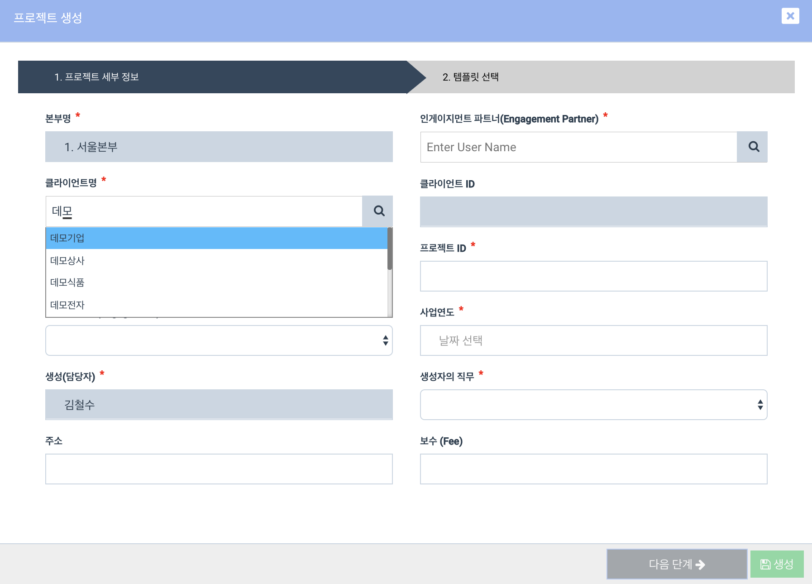
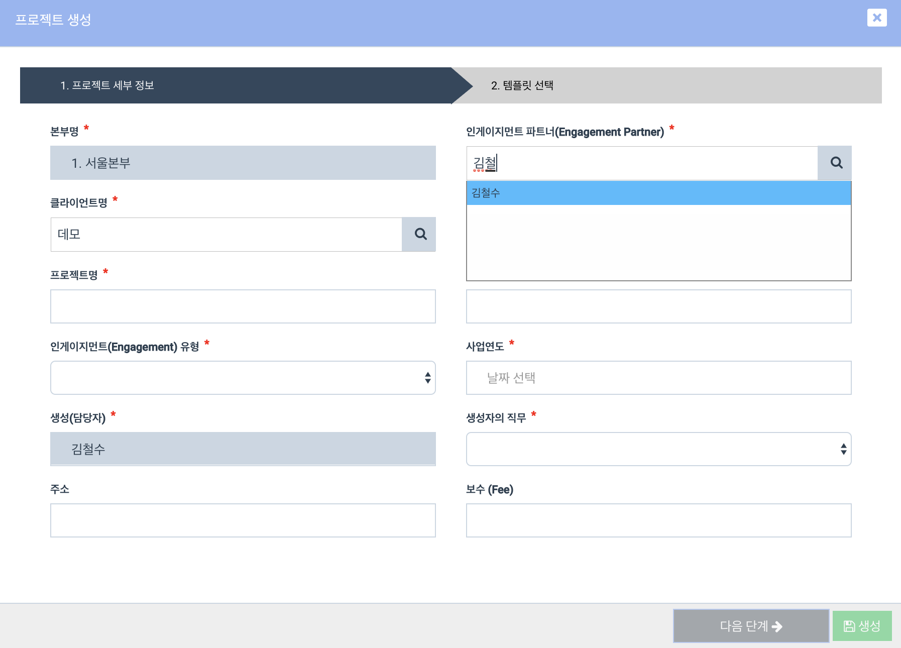

# \(ENG\)"All information is entered on the project screen, but it does not go to the next step."

The 2018-12-19 \(Wed\) update changed the client and engagement partner input methods when creating a project. You can also find more information on the ['Create Project'](../undefined-2/setup/x.-2/x-1..md) page.

### How to search for and enter the client information and engagement partner name when creating a project

1. Enter at least two characters of the client or engagement partner's name in the input box.
2. An autocomplete list appears at the bottom.
3. Select the appropriate client or engagement partner.

#### Attention:

1. The magnifying glass icon does not play a separate role. \(To Be Updated\)
2. **Enter the name of the client or partner more than one letter**. \(Hangul requires two or more characters due to Unicode problem\)
3. **Be sure to select the client or partner's name from the list of autocomplete that appears.**
4. If you manually enter the name of a client or partner, you cannot proceed to the next step. **Please be sure to select the name of the autocomplete item.**

## Client Input Screen

Note: Be sure to 'click' the client name in the autocomplete field to 'select' it.

## Engagement Partner Input Screen

Note: Be sure to 'click' the engagement partner name in the autocomplete field to 'select' it.

