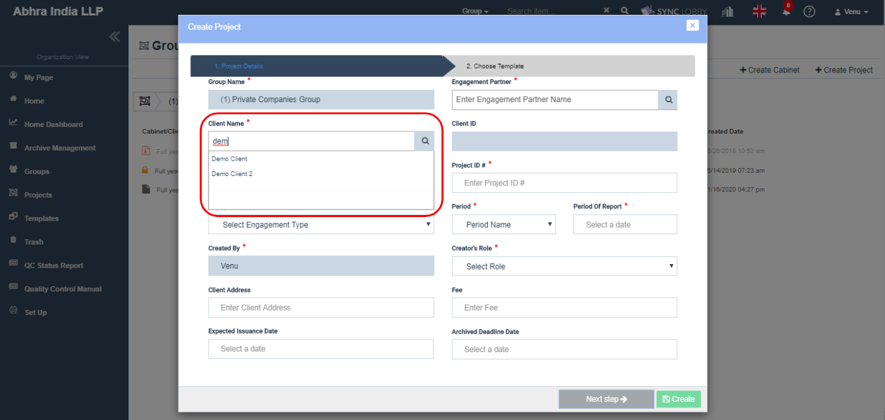
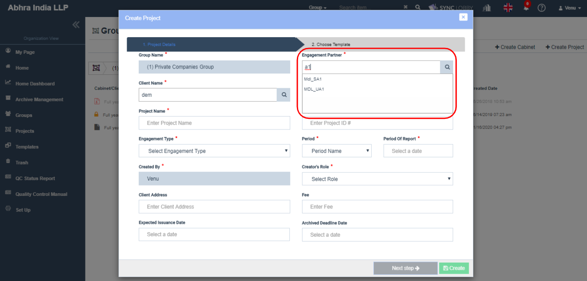

# \(ENG\)"All information is entered on the project screen, but it does not go to the next step."

The 2018-12-19 \(Wed\) update changed the client and engagement partner input methods when creating a project. You can also find more information on the ['Create Project'](../undefined-2/setup/x.-2/x-1..md) page.

### How to search for and enter the client information and engagement partner name when creating a project

How to enter client and engagement partner when creating a project?

1. Enter at least two characters of the client or engagement partner's name in the input box.
2. An autocomplete list appears at the bottom.
3. Select the appropriate client or engagement partner.

#### Attention:

1. The magnifying glass icon doesn't have any significance. \(Coming soon\)
2. Enter more than one letter of the name of the client or engagement partner.
3. Ensure to select the name of the client or partner from the autocomplete list only that appears.
4. If you enter the name of the client or partner directly, you may get an error.

## Search and select the Client

Note: Be sure to 'click' the client name in the autocomplete field to 'select' it.

Note: Ensure to select the client from the autocomplete list.

## Engagement Partner Input Screen

## Search and select the Engagement Partner

Note: Ensure to select the partner user from the autocomplete list.

Note: Be sure to 'click' the engagement partner name in the autocomplete field to 'select' it.

