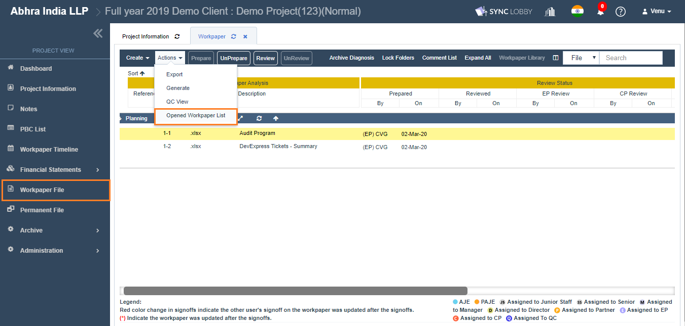

# \(Venu/Done\)"The file is not saved when modifying the contents using Online-Editor"

#### Issue Observation

> Sometimes, when you open a file online, edit and click the "Save" button, you get the warning message saying "Do you want to leave the site? Changes you made may not be saved." Clicking the 'Leave' button closes the online file without saving the changes.


**Why does this happen?**

It occurs when a user tries to modify a file that was modified and saved by another user in advance. This is a bug to be updated in the next release.


## How to Resolve the issue


1. Instead of using the online editor, please download the file and proceed with your work.
2. Please use the "[Replace](file-replace.md)" function to replace the existing document of the cloud with the updated document on the desktop.



In addition, please check the list of opened files when editing online documents to avoid duplicate access.


## 1. Replace the existing document of the cloud with the document on your local storage

### 1-1. Download a workpaper

1-1-1. Please **"Right-click"** on the file that you want to edit and select **"Download"**.

1-1-2. Alternatively, double-click the file you want to edit to open it online, then **click the Download button**.

### 1-2. Edit the contents of the file

Edit and save the downloaded file using your personal computer's MS Office.

### 1-3. Replace the file

Replace the existing file of the cloud with the updated file in step 1-2.

> You can **right-click the existing file** in the application to select the **Replace** function.

You can find more detailed instructions on how to replace a file \([FAQ:"How can I replace a file?"](file-replace.md)\).

## 2. Check your list of opened files to avoid duplicates

In Workpapers Screen, click the 'Opened Workpaper List' option under the 'Actions' menu.

An open file list \(By me/By others\) will appear as shown below and click the **Close or Close All** button to close the opened documents.


Please make sure to check the 'Opened By Others' tab also.



* There may be team members who don't have "Close" or "Close All" permissions. \('Project User' users\) 
* If you force close the file, other users' unsaved modifications may be lost. 



In the online editor, if you close the browser tab by pressing the browser's 'X' button, the file is not considered closed. Please close it by clicking the 'Close' button on the top right of the screen.


1. If you check the list of open files and avoid duplicate operations, you may encounter unexpected errors. If you are doing important and urgent work, we recommend you to use **the first method \(1. Replace the existing document in the cloud with the document on your local storage\).**

