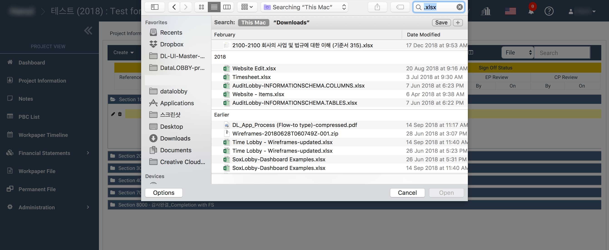
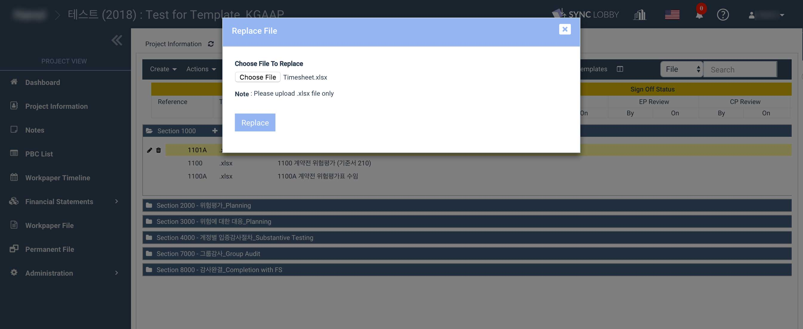

# 파일 교체하기 \(Replace\)

## 감사조서 우클릭 메뉴를 통해 온라인 에디터를 이용하지 않고 조서를 교체할 수 있습니다. 

### 1. 감사조서를 선택하고 우클릭 합니다. 가장 아래쪽의 Replace 를 클릭합니다. 

1. 교체하고자 하는 감사조서를 선택합니다. 
2. 감사조서를 선택하면 해당 감사조서가 노란색으로 표시됩니다. 
3. 선택한 감사조서 위에서 마우스 오른쪽 버튼을 누릅니다. 
4. 나타난 메뉴 중 가장 아래쪽의 **Replace** 를 클릭합니다. 

### 2. 파일 선택창이 나타납니다. 

1.  1에서 Replace를 클릭하면 파일 선택창이 나타납니다. 
2. '**Choose File**' 을 누릅니다. 

> 주의: 선택한 기존 파일과 동일한 형식의 파일로만 교체할 수 있습니다. \(예를 들어, 선택한 파일이 .xlsx 인 경우 .xlsx 형식의 파일로만 교체할 수 있습니다.\)

### 3. 교체할 파일을 선택합니다. 

1. 2에서 'Choose File' 버튼을 누르면 파일 선택창이 나타납니다. 
2. 교체할 파일을 선택합니다. 

> 주의: 선택한 파일과 동일한 형식의 파일로만 교체할 수 있습니다.

### 4. 교체될 파일의 이름을 확인합니다. 

1. 3에서 교체할 파일을 선택하고 확인 또는 열기 버튼을 누르면 다시 다음과 같은 화면으로 돌아옵니다. 
2. 'Choose File' 버튼 오른쪽에 선택한 파일의 이름이 나타나는지, 적절한 파일을 선택했는지 확인합니다. 
3. '**Replace**' 버튼을 클릭합니다.  

### 5. 화면 상단의 붉은색 로딩바가 완료되기를 기다립니다. 화면 우측 상단에 교체 완료 메시지가 나타납니다. 

1. 파일 크기가 큰 경우 업로드에 시간이 필요합니다. 화면 상단에 표시되는 붉은색 로딩바가 완료되기를 기다려 주십시오. 
2. 파일이 교체되면 화면 우측 상단에 완료 메시지가 나타납니다. 

## 주의사항 1: 파일 교체\(Replace\)를 이용하는 경우 기존 파일의 제목은 변경되지 않습니다. 제목은 교체되지 않고 내부 컨텐츠만 교체됩니다. 

## 주의사항 2: 파일이 열려있는 경우 교체가 불가능합니다. 

동일한 양식의 파일인데도 교체가 진행되지 않는 경우, 화면 상단 우측의 종모양 아이콘을 클릭하여 교체하고자 하는 파일이 열려있지 않은지 확인하여 주시기 바랍니다. 

> 'Close All' 또는 개별 파일의 'X' 버튼을 눌러 열려있는 파일을 닫을 수 있습니다.

