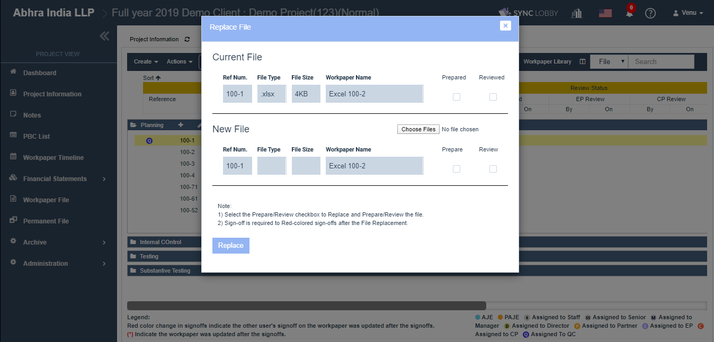
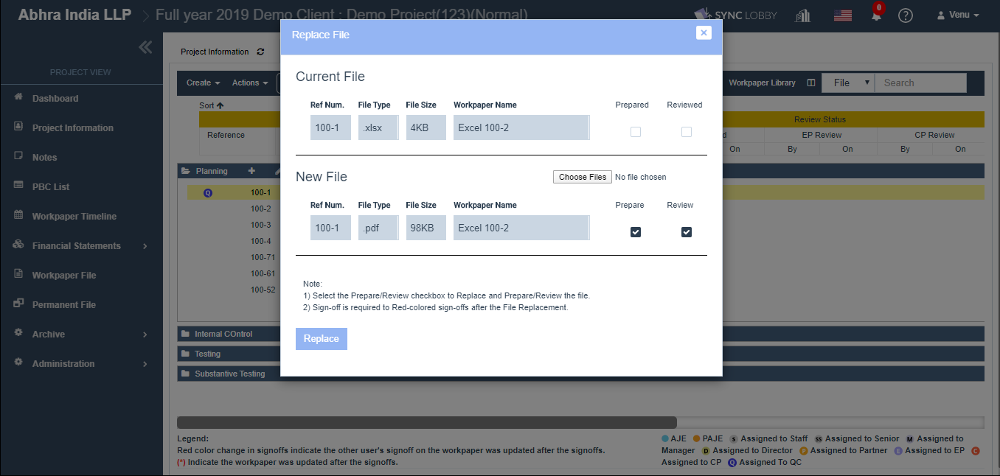
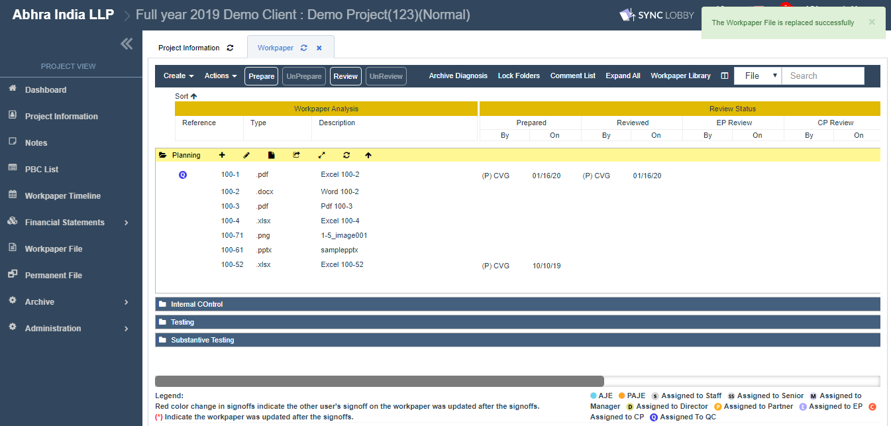
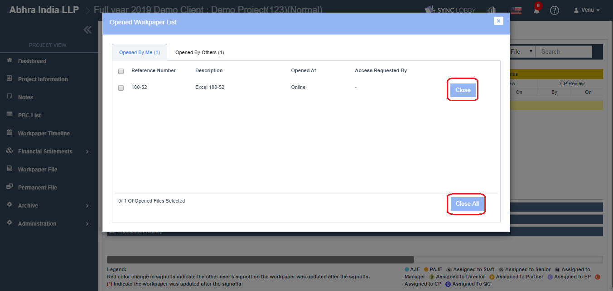

# \(Venu\)"How can I replace a file?"

## Audit files can be replaced with the right-clicking menu without using the online editor.

### 1. Select and right-click on the audit file. Click the 'Replace' at the bottom of the list.

* Select the audit file that you want to replace, it gets highlighted in yellow.
* Right-clicking the file presents the list of options where you can see the 'Replace' option.

### 2. The file selection window appears.

* Clicking the 'Replace' on \#1 opens the 'Replace File' pop-up.
* You can observe the details of selected file \(Ref Num, File Type, File Size, Workpaper Name, Prepared, Reviewed\) under the 'Current File' section.

> Note: You can replace a file with any other file type. \(For example, if the selected file is .xlsx, you can replace it with a file of .pdf format.\)

### 3. Select the file for the replacement

1. Click the 'Choose File' button on \#2 opens the file selection window.
2. Select the file to replace.
3. Click the 'Open' button.

> Note: You can replace a file with any other file type.

### 4. Verify the file, and Prepare/ Review the file

1. The details \(File Type, File Size\) of selected file on \#3 are displayed in the 'New File' section. 
2. Select the Prepare/ Review check-boxes to Prepare/ Review the file.
3. Click the '**Replace**' button.  

> The default preference is check for the Prepare checkbox and uncheck for the Review checkbox.
>
> QC can't review the file unless there is a Review to a file.
>
> Prepare checkbox is always disabled to 'QC' user as he can't do any Prepare.

### 5. Wait for the red loading bar to finish at the top of the screen. The replacement completion message appears at the top right of the screen.

1. Uploading may take time if the file size is large.
2. Please wait for the red loading bar to finish at the top of the screen.
3. Upon successful replacement,
   1. A success message appears at the top right of the screen.
   2. The file gets auto Prepared/ Reviewed if the respective checkbox is selected on the username who replaces the file.

> If Prepare/ Review checkbox is NOT selected, then Red star \(\*\) will be displayed to all sign-offs.
>
> If Prepare/ Review checkbox is selected, Red star \(\*\) will be displayed to all sign offs and for higher level sign-offs changed to Red color.

## Note 1: If you use Replace, the title of the existing file will not be changed, only the internal content gets updated.

## Note 2: If a file is opened, it cannot be replaced.

If you want to replace a file, please ensure that the file must not be there in the "Opened By Me & Opened By Others" tabs of 'Opened Workpaper List' pop-up.

> You can close opened files by pressing 'Close All' or the 'Close' button of an individual file.

