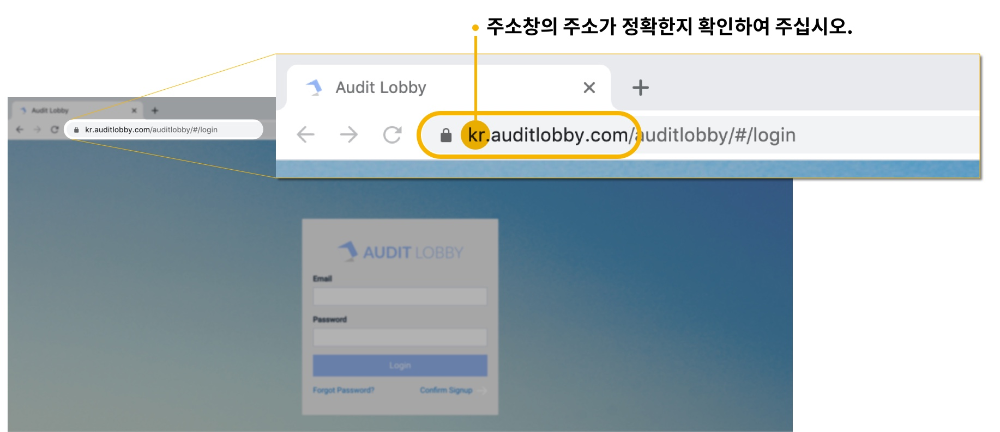

# \(Venu\)"Suddenly, I cannot log in."

> ## "What should I do if I can’t log in to the application?"

## 1. Check that the address of the adobe is correct.

> For example, if you belong to Ganada accounting firm and have a dedicated instance, your address is ganada.auditlobby.com.

> If your accounting firm doesn't have a dedicated instance, then use
>
> 1. us.auditlobby.com, if you are a USA user
> 2. ind.auditlobby.com, if you are an Indian user.

## 2. If the address is correct, check the email address and password one more time.

## 3. If you forgot your password, then you can reset it.



## 4. 서포트 메일로 문의


1~3을 시도하였는데도 오류가 지속되는 경우 서포트 메일로 연락 부탁드립니다.

공용 서포트 이메일 주소 support@datalobby.co.kr 또는 각 회계법인 별 서포트 이메일 주소를 통해 문의하실 수 있습니다.


