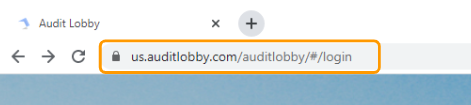

# \(Venu/Done\)"Suddenly, I can't log in."

> ## "What should I do if I can’t log in to the application?"

## 1. Please ensure that your application URL address is correct.

> For example, if you belong to Ganada accounting firm and have a dedicated instance, your address is ganada.auditlobby.com.

> If your accounting firm doesn't have a dedicated instance, then use
>
> 1. us.auditlobby.com, if you are a USA user
> 2. ind.auditlobby.com, if you are an Indian user

## 2. If the address is correct, check the email address and password one more time.

## 3. If you forgot your password, then you can reset it.



## 4. Contact Us


If the error persists after trying 1~3, you can contact us on the support email address below.

* support@datalobby.com, if you don't have a dedicated instance.
* {firm\_name}.support@datalobby.com, if you have a dedicated instance.


