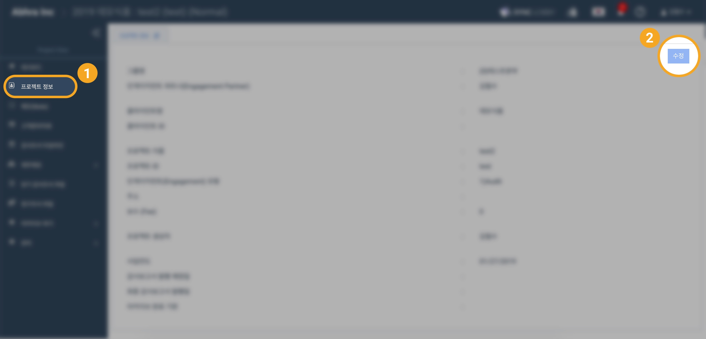
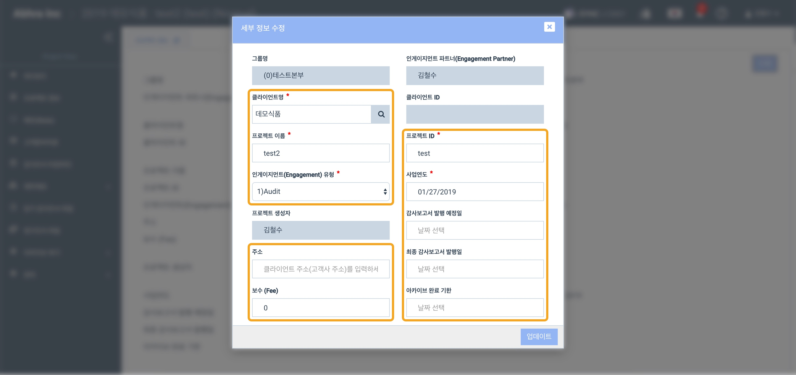

# \(ENG\)"프로젝트 정보는 어떻게 수정하나요?"

## 요약보기

1. 프로젝트 정보를 수정할 프로젝트를 선택합니다. 
2. 프로젝트 정보 메뉴를 선택합니다. 
3. 화면 우측 상단에서 수정버튼을 클릭합니다.
4. 원하는 정보를 수정한 후 저장합니다.


프로젝트 내부에서 Admin 권한을 가지고 있는 사용자만 프로젝트 정보를 수정할 수 있습니다.


1. 수정하고자 하는 프로젝트에 들어가서 프로젝트 정보에 들어갑니다.
2. 우측 상단의 수정 버튼을 클릭합니다.

1. 클라이언트, 프로젝트 이름, 인게이지먼트 유형, 주소, 보수, 프로젝트 ID, 사업연도, 감사보고서 발행 예정일, 최종 감사보고서 발행일, 아카이브 완료 기한에 대한 세부 정보를 수정할 수 있습니다.
2. 업데이트 버튼을 눌러 수정한 사항을 적용합니다.  

