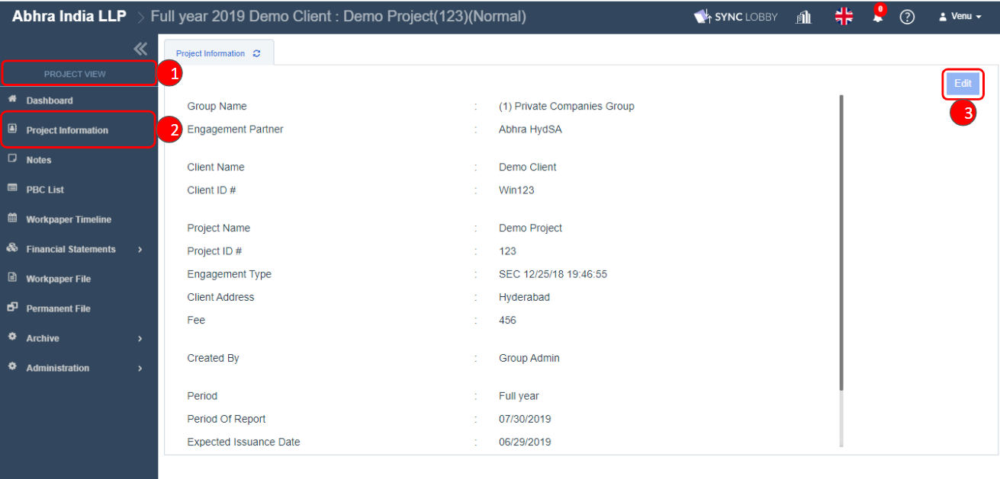
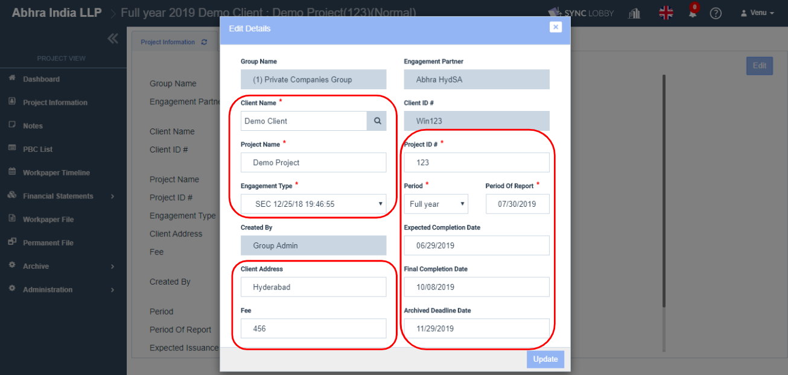

# \(Venu/Done\)"How can I edit the project information?"

## Summary

1. Select the project to edit.
2. Click the menu of project information.
3. Click the edit button on the right side of the screen.


Only the user who has admin authority can edit the project information.


1. Go to Project Information.
2. Click Edit on the right side of the Project Information screen.

1. You can change the information of Client Name, Project Name, Project ID\#, Engagement Type, Period, Period of Report, Client Address, Fee, Expected Issuance Date, Final Issuance Date, Archive Deadline Date.
2. Click 'Update' button to save the edited information.

