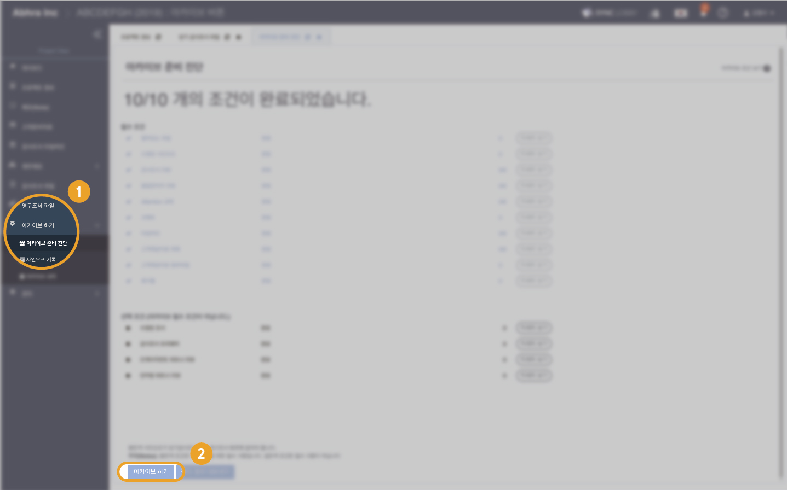

# \(ENG\)"Project Lock은 어떻게 하나요?"

* 아카이브 준비 진단의 필수 조건을 모두 만족하면 '아카이브 하기' 버튼이 나타납니다.
* 프로젝트 잠금 처리\(Lock\) 해야 아카이브를 진행할 수 있습니다.
* 아카이브 준비 진단 페이지 하단의 ‘아카이브 하기’ 버튼을 클릭합니다.

* 아카이브 하기 버튼을 누르면  본인 확인을 위해 이메일 주소 입력창이 나타납니다.  
* 본인의 이메일 주소를 입력한 뒤 ‘ARCHIVE’ 버튼을 클릭합니다.
* 아카이브 하기 버튼을 누르면 프로젝트 잠금 요청창이 나타납니다.
* 프로젝트 잠금\(Lock\)버튼을 클릭합니다.  

* 프로젝트 잠금은 아카이브 준비 진단 화면에 있는 프로젝트 잠금\(Lock\) / 잠금 해제\(Unlock\) 버튼으로 가능합니다. 이 버튼은 프로젝트 관리자 \(project admin\) 또는 프로젝트 아카이브 관리자\(project & archive admin\)인 경우 나타납니다. 
* 프로젝트를 잠그면 조서의 내용을 수정할 수 없습니다.
* 프로젝트를 잠그면 프로젝트 제목 옆에 주황색 자물쇠 아이콘이 나타납니다.
* 아카이브에 성공하면 '마이페이지' 화면으로 전환되며 성공 알림 메시지가 나타납니다. 

