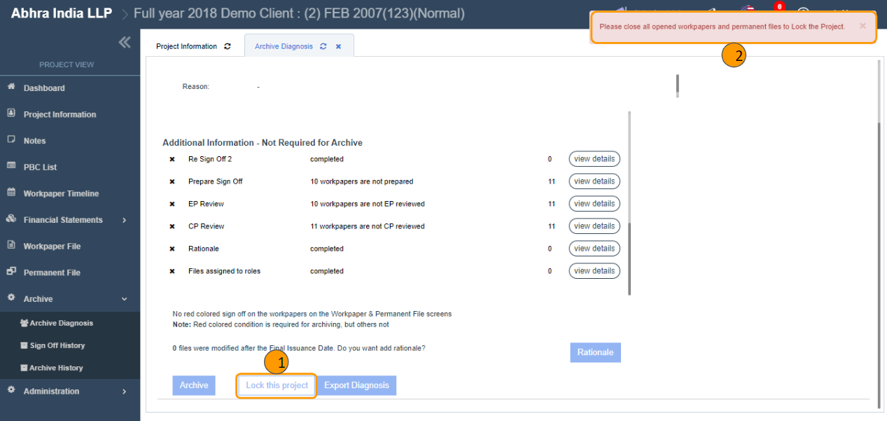

# \(Venu/Pending\)"How can I lock the project?"


Only the user who is a 'Project & Archive Admin' and 'Project Admin' can lock the project.


## 1. Preconditions for locking the project

1. The prerequisite for the project lock is "All opened files should be closed”.
2. Without closing the opened files clicking the 'Lock this project’ button displays the alert below.
   * **Alert:** Please close all opened workpapers and permanent files to Lock the Project.

### 1.1. How can I close the opened files?

1. Click the 'Workpaper File' on the left navigation menu of the 'Project View'.
2. Click the 'Actions &gt; Opened Workpaper List' at the top of the screen.
3. Check if there any opened files existed on 'Opened By Me' tab.
4. Choose the 'Select All' checkbox.
5. Click the 'Close All' button at the bottom-right of the dialog.
6. Click the 'Opened By Others' tabs.
7. Check if there any opened files existed.
8. Choose the 'Select All' checkbox.
9. Click the 'Force Close' button at the bottom-right of the dialog.
10. Close the dialog.
11. Click the 'Permanent File' on the left navigation menu of the 'Project View'.
12. Click the 'Actions &gt; Opened Permanent File List' at the top of the screen.


Repeat the steps \#3~9 to close the opened permanent files.



Please be cautious while force closing the files that are opened by others, as they may lose their changes.


## 2. Project can be locked in two ways

1. Using the 'Lock this project' button.
2. While archiving the project.

### 2.1. Using the 'Lock this project' button

1. Visit the project that you wish the lock.
2. Visit the 'Archive &gt; Archive Diagnosis' screen on the left navigation menu of the 'Project View'.
3. Click the 'Lock this project' button.
4. Click the 'OK' button in the confirmation alert.
5. Success message will be displayed on the screen.
6. You can view the lock icon next to the project name at the top of the screen.

* When you click the archive button, an email address input window appears to confirm your identity.
* Enter your email address and click the 'Archive' button. 
* If you click the 'Archive' button project lock window will appear.
* Click the Lock this Project button.

* You can lock the project with the Lock this project button on the Archive Diagnosis screen. This button appears if you are a project administrator \(project admin\) or project & archive admin. 
* If you lock the project, you cannot change the contents of the workpaper file. 
* When you lock the project, an orange lock icon appears next to the project title. 
* If the archive is successful, screen will be switched to the My Page screen and a success notification message will appear.

