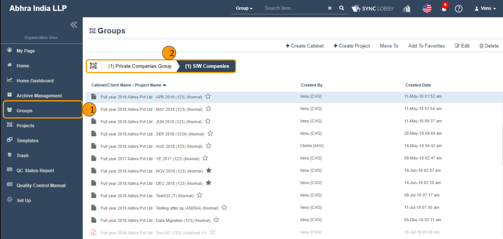
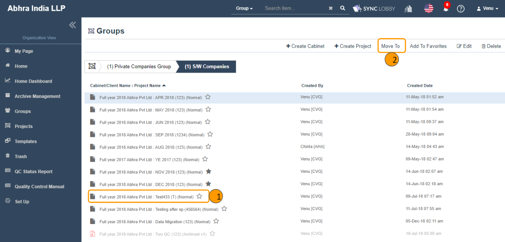
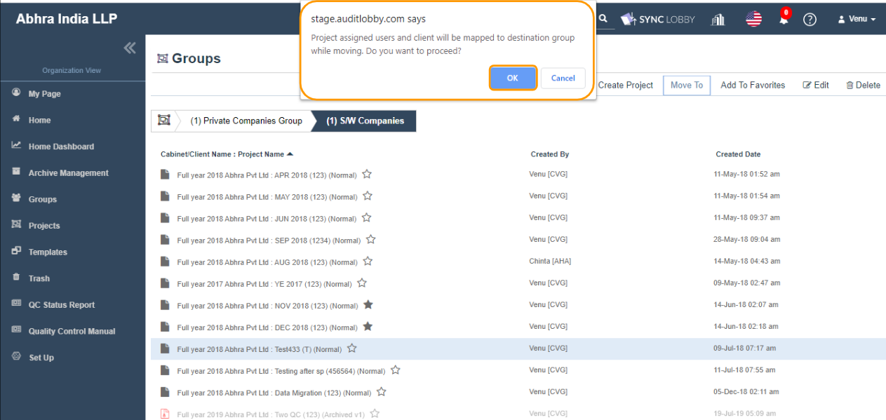
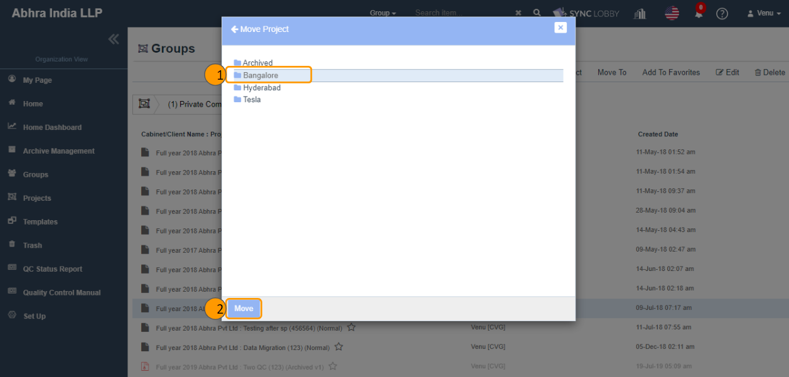

# \(Venu/Pending\)"How can I move the project."

## 1. Navigate to the projects screen from the 'Groups' the left navigation menu.

## 2. Select the project that you wish to move.

## 3. Click the "Move" button at the top of the screen.

## 4. Read the warning message and click the 'OK button.


If you move a project from Group-A to Group-B, then automatically all assigned users of the project will be mapped to the Group-B.


## 5. Navigate to the cabinet that you wish to move the project.

1. A dialog will be opened that shows a list of groups.
2. It follows the group and cabinet structure.
3. Double-click the intended group.
4. A list of cabinets belongs to the group will be displayed.
5. Either select the intended cabinet or double-click to view its child cabinets. 
6. This way, find the desired cabinet and select.

## 5. Click the Move button and wait for the red loading bar at the top of the screen to finish.

1. Click the 'Move' button at the left-bottom of the dialog.
2. Please wait until the red loading bar is finished at the top of the screen.
3. A success message will be displayed at the top right of the screen.
4. The project will be moved to the respective cabinet you selected.


You can move only the project of type 'Normal'. The Replica, Archived, Unarchived projects cannot be moved to another cabinet or group.

As we have been receiving the feedback to provide the move feature for Replica, Archived, Unarchived projects, will provide move for these projects types to a different cabinet but within the same group itself. 


