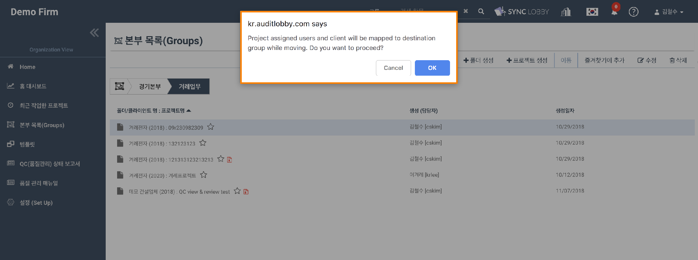
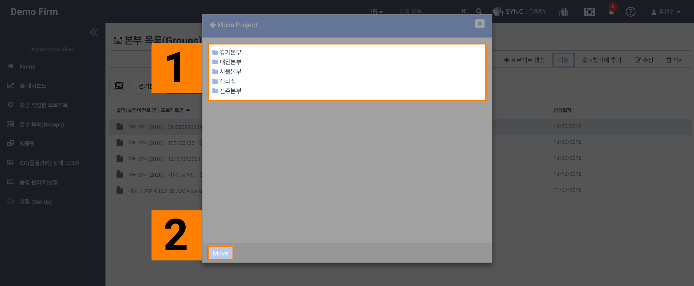

# \(ENG\)"I want to move the project."

## 1. Select the project you want to move.

## 2. Click the "Move" button at the top of the screen.

## 3. Confirm the warning and press OK.

## 4. Double-click the folder to move the project.

If you select a folder according to the folder structure, nothing may appear on the screen. Project movement works normally.

## 5. Click the Move button and wait for the red loading bar at the top of the screen to finish.

If you press the Move button several times, the command may be duplicated and it may take more time. Please wait for the red loading bar at the top of the screen to proceed.

