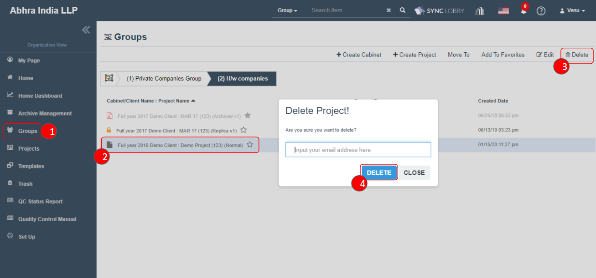

# \(Venu\)"How can I delete a project?"

## The project can be deleted in two ways.

1. Delete a project from the Groups screen.
2. Delete a project from the Project screen. 


Only the Super Admin of the organization or the user who created the project can delete the project.


## 1. Delete a project from the Groups screen.

1. Locate the project on the Groups screen.
2. Upon selecting the project, the Delete button appears on the top right of the screen.
3. Clicking the Delete button opens an email input pop up.
4. If you enter your email and clicking the Delete button deletes project.

1. Locate the project on the Groups screen.
2. Right-click the project you want to delete and select the Delete option.
3. An email input pop up will be opened, if you enter your email and clicking the Delete button deletes project.

## 2. Delete a project from the Project screen.

1. In the Projects screen, find the project you want to delete.
2. Clicking the ... button on the right side of the screen displays the Delete option.
3. Selecting the Delete option opens an email input pop up.
4. If you enter your email and clicking the Delete button deletes project.

