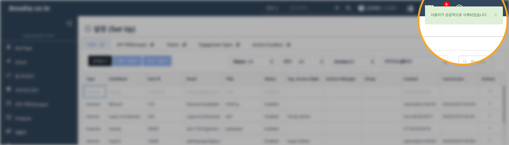

# \(Venu/Pending\)"How can I suspend or remove a user?" - Suspend / Remove User

If the user has left the company or needs to restrict access to the app for other reasons, you can block the user or delete the account.

## Summary 

1. Summary about how to suspend/remove the user
2. Suspend the user
3. Remove the user
4. Restore suspended user account

## 1. Summary about how to suspend/remove the user.

1. Click the 'Set Up' button from the left menu column of the Organization View
2. Click the 'User' tab from the setup menu screen
3. Search for the name of the user who wants to remove or delete
4. Click the menu button \(three point button\) at the right end of the user information and click Suspend
5. A message appears on the upper right of the screen saying that the user has been blocked and the user is greyed out

   > Users will no longer be able to log in to auditlobby and will be deactivated in all their projects. The user's sign-off and activity are preserved in auditlobby. If you recover a user, you can reactivate as the same user. However, even if the user is restored, the individual project is deactivated. Therefore, the user must be activated separately in the project to which access is granted.

6. If you need to delete a user, click the right-click menu button of the blocked user and click Remove

   > Deleted users disappear from the user list, sign-offs and activity history are preserved in the lobby. You will not be able to regenerate the same account when you delete it, and you will not be able to continue working on your old record. Be careful when deleting users.

## 2. Suspend the user.

> Using this, you can disable \(block\) the user temporarily. Only Super Admin has access to disable the user information.
>
> * Blocked users will not be able to log in to the Audit Lobby.
> * Blocked users are deactivated inside the project.
> * The sign-off and activity of the blocked user are preserved.
> * Blocked users can be restored again.

1. Click the 'Set Up' in the left navigation menu of the 'Organization View'.
2. Select the 'Users' tab at the top of the screen.
3. Click the three dots button of the user that you wish to Suspend.
4. A list of action items will be displayed.
5. Select the 'Suspend' option.
6. The 'Suspend User' confirmation dialog will be displayed.
7. Click the 'SUSPEND' button in the confirmation to disable the user.
8. After suspending the user, you can witness the changes below:
   * The user record will be displayed in a grayed-out color.
   * The status of the user gets changed to 'Disabled' from the 'Enabled'.
   * The user will be deactivated inside all assigned projects.
9. Suspended users cannot log in to the application.

> If a user is assigned to at least one project, then one more additional confirmation alert gets displayed that shows the list of assigned projects to the user.
>
> * Click the 'SUSPEND' button in the confirmation to disable \(block\) the user.
> * Blocked users will be auto-deactivated inside all assigned projects.
> * Signed-off and activity history of blocked users will be preserved in Audit Lobby.

## 3. Remove the user.


* You must "block" users before you can "delete" them. Please first "block" the user to be deleted
* Deleted users can not be recovered. Be careful when erasing
* If a project with a deleted user is archived, the user is recorded as deleted



* The sign-off and activity history of the deleted user is retained


## Restore suspended user account.


* Deleted user can not be restored



* Recovered users can log in to the Idlo lobby, but are still disabled within individual projects. After restoring the user, activate the user within the project that you want to grant access to


