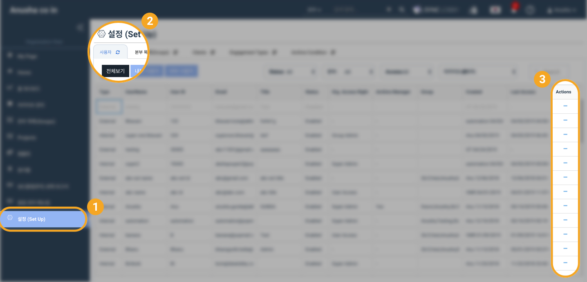
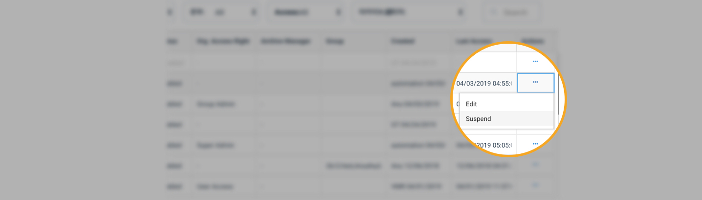
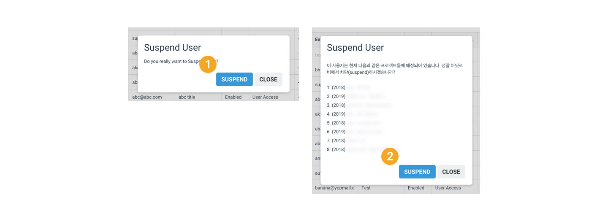
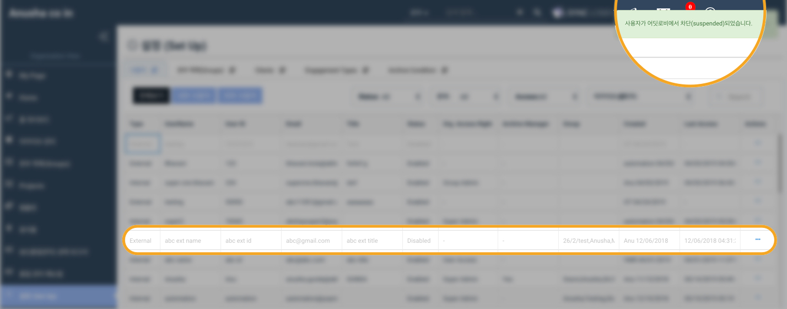
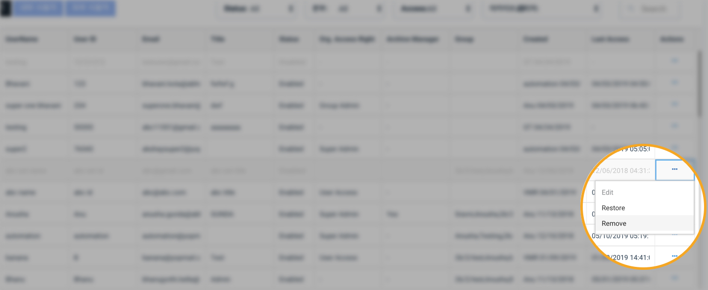
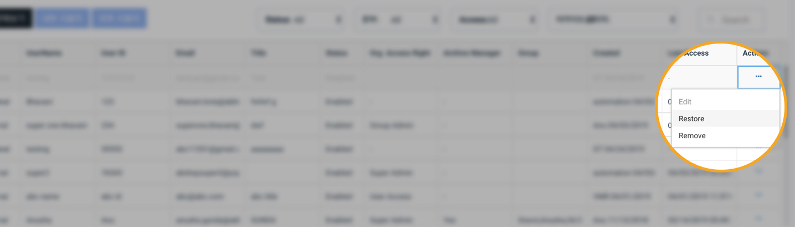

# \(ENG\)"퇴사자는 어떻게 처리하나요?" - 사용자 차단 / 삭제하기

사용자가 퇴사하였거나 다른 이유로 인해 어딧로비 이용을 제한해야 할 경우, 사용자를 차단하거나 계정을 삭제할 수 있습니다. 단, 계정을 삭제하는 경우 동일한 이메일로 재등록할 수 없습니다.

## 이 글의 목차

1. 사용자 차단/삭제 요약보기 
2. 사용자 차단하기   
3. 사용자 삭제하기  
4. 차단한 사용자 복구하기   

## 1. 사용자 차단/삭제 요약 보기

1. 법인용 화면\(Organization View\)에서 '**설정**\(Setup\)' 메뉴를 선택합니다.  
2. 설정 메뉴 화면에서 '**사용자**\(User\)' 탭을 선택합니다. 
3. 차단 또는 삭제할 사용자를 검색합니다.  
4. 사용자 정보 오른쪽 끝의 메뉴 버튼\(3개의 점으로 된 버튼\)을 눌러 **차단**\(Suspend\)을 클릭합니다. 
5. 화면 오른쪽 위에 사용자를 **차단**하였다는 메시지가 나타나며 해당 사용자가 회색으로 변합니다.

   > 이후 사용자는 어딧로비에 로그인 할 수 없으며, 모든 소속 프로젝트에서 비활성화 처리됩니다. 사용자의 사인오프 및 활동 내역은 어딧로비 내에 보존됩니다. 사용자를 복구하는 경우 동일한 사용자로 다시 활동할 수 있습니다. 단, 사용자를 복구하더라도 개별 프로젝트 내에는 비활성화 처리되어 있으므로, 접근을 허가하고자 하는 프로젝트에서 별도로 사용자를 활성화 하여야 합니다.

6. 사용자를 삭제해야 하는 경우, 차단된 사용자의 오른쪽 끝 메뉴 버튼을 눌러 **삭제**\(Remove\)를 클릭합니다.

   > 삭제된 사용자는 사용자 목록에서 사라지며 사인오프 및 활동 내역은 어딧로비 내에 보존됩니다. 삭제 시 동일한 계정을 다시 생성할 수 없으며, 예전의 기록을 이어서 작업할 수 없습니다. 사용자 삭제시 주의하여 주십시오.

## 2. 사용자 차단하기


* 차단된 사용자는 어딧로비에 로그인 할 수 없습니다. 
* 차단된 사용자는 프로젝트 내에서 비활성화 처리됩니다. 
* 차단된 사용자의 사인오프 및 활동은 그대로 보존됩니다. 
* 차단된 사용자는 다시 복구할 수 있습니다. 


1. 법인용 화면의 메뉴에서 '설정\(Setup\)' 을 선택합니다. 
2. 화면 상단에서  '사용자' 탭을 선택합니다. 
3. 차단하고자 하는 사용자의  오른쪽 끝에서 점 세 개로 이루어진 버튼을 클릭합니다. 

* 버튼을 누르면 'Edit' 과 'Suspend' 메뉴가 나타납니다.  
* 'Suspend' 를 선택합니다. 

1. '이 사용자를 정말 차단하시겠습니까?' 라는 경고창이 나타나면 'Suspend' 를 누릅니다. 
2. 사용자가 프로젝트에 배정되어 있는 경우 배정된 프로젝트 목록이 나타납니다. 계속 진행할 경우 'Suspend'를 누릅니다.

   > * 배정된 프로젝트가 있더라도 사용자를 차단할 수 있습니다. 차단된 사용자는 배정된 프로젝트 내부에서 비활성화 됩니다. 
   > * 차단된 사용자의 사인오프 및 활동 내역은 어딧로비에 그대로 남아있습니다. 
   > * 차단된 사용자가 있는 프로젝트가 아카이브 될 경우, 해당 사용자는 차단된 상태로 기록됩니다.

## 3. 사용자 삭제하기


* 사용자를 먼저 '차단'해야 '삭제'할 수 있습니다. 삭제할 사용자를 먼저 '차단' 하여 주십시오. 
* 삭제한 사용자는 복구할 수 없습니다. 삭제 시 주의하여 주십시오. 
* 삭제된 사용자가 있는 프로젝트가 아카이브 될 경우, 해당 사용자는 삭제된 상태로 기록됩니다. 



* 삭제된 사용자의 사인오프 및 활동내역은 그대로 보존됩니다. 


## 4.  차단한 사용자 복구하기


* 삭제한 사용자는 복구할 수 없습니다. 



* 복구된 사용자는 어딧로비에 로그인 할 수 있지만, **개별 프로젝트 내에서는 여전히 비활성화 상태**입니다. 사용자를 복구한 이후 접근을 허가하고자 하는 프로젝트 내에서 사용자를 활성화하여 주십시오. 


