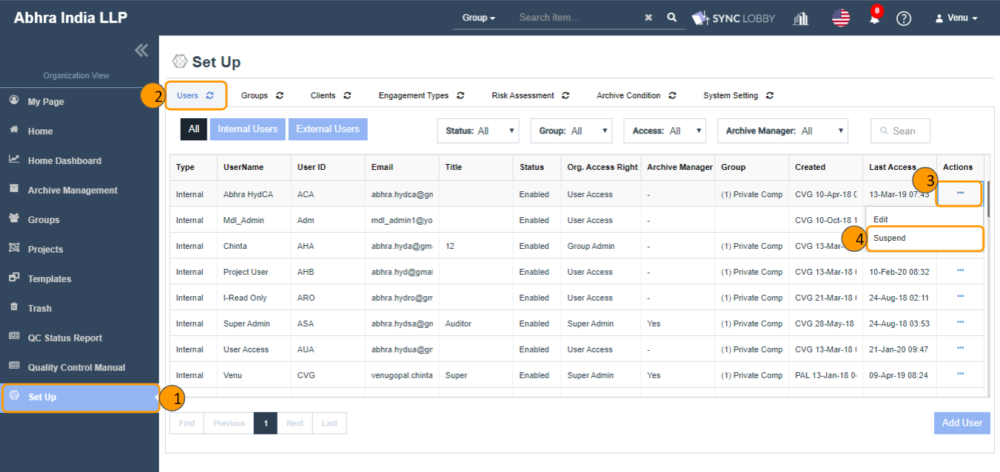

# \(Venu/Done\)"How can I suspend or remove a user?" - Suspend / Remove User

If the user has left the company or needs to restrict access to the app for other reasons, you can block the user or delete the account.

## Summary 

1. Suspend the user
2. Remove the user
3. Restore suspended user account

## 1. Suspend the user.

> Using this, you can disable \(block\) the user temporarily. Only Super Admin has access to disable the user information.
>
> * Blocked users will not be able to log in to the Audit Lobby.
> * Blocked users are deactivated inside the project.
> * The sign-off and activity of the blocked user are preserved.
> * Blocked users can be restored again.

1. Click the 'Set Up' in the left navigation menu of the 'Organization View'.
2. Select the 'Users' tab at the top of the screen.
3. Click the three dots button of the user that you wish to Suspend.
4. A list of action items will be displayed.
5. Select the 'Suspend' option.
6. The 'Suspend User' confirmation dialog will be displayed.
7. Click the 'SUSPEND' button in the confirmation to disable the user.
8. After suspending the user, you can witness the changes below:
   * The user record will be displayed in a grayed-out color.
   * The status of the user gets changed to 'Disabled' from the 'Enabled'.
   * The user will be deactivated inside all assigned projects.
9. Suspended users cannot log in to the application.

> If a user is assigned to at least one project, then one more additional confirmation alert gets displayed that shows the list of assigned projects to the user.
>
> * Click the 'SUSPEND' button in the confirmation to disable \(block\) the user.
> * Blocked users will be auto-deactivated inside all assigned projects.
> * Signed-off and activity history of blocked users will be preserved in Audit Lobby.

## 2. Remove \(delete\) the user.

> Using this, you can delete the user from your organization permanently. Only Super Admin has access to delete the user.
>
> * The sign-off and activity history of the deleted user will be preserved in the Audit Lobby.
> * If a project with a deleted user is archived, the user is recorded as deleted.

1. In order to remove a user from the Organization, first the user needs to be 'Suspended'.
2. Click the three dots button of the user that you wish to remove.
3. A list of action items will be displayed.
4. Click the 'Remove' option.
5. The 'Remove User' confirmation dialog will be displayed.
6. Clicking the 'REMOVE' button in the confirmation alert removes \(disappears\) the user from the 'Users' screen.


When you try to add an user with the email of deleted user, then an alert will be prompted to you saying that "A user with the same Email already existed in the Deleted status. Please click on Restore User to enable the user or try with different Email".

* Click the 'Restore User' button if you want to activate the user. \[OR\]
* Change the email id and click the 'Add User' button.


## 3. Restore suspended user account.

> Using this, you can restore the user who got suspended, so that the user will be an active user in your firm.
>
> Restored users can log in to the Audit Lobby, but are still disabled inside projects. After restoring the user, activate the user within the project that you want to grant access to.

1. Click the three dots button of the user that you wish to 'Restore'.
2. A list of action items will be displayed.
3. Click the 'Restore' option.
4. The 'Restore User!' confirmation dialog will be displayed.
5. Clicking the 'RESTORE USER' button in the confirmation alert restores the user.
6. After the restoring the user, you can witness the following changes:
   * The status of the user changes to 'Enabled' from the 'Disabled'.
   * The user record turns to normal color from the gray color.
   * Still, the status of the user is 'Inactive' if in case he was assigned to any project\(s\) during the Suspend time.


Deleted user can not be restored. But they can be re-added again.

1. Click the 'Add User' button.
2. Enter the deleted user's email id and other details.
3. Click the 'Add User' button.
4. The 'Restore User!' alert will be displayed.
5. Click the 'Restore User' button if you want to re-add \(activate\) the user.


