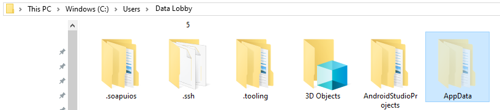
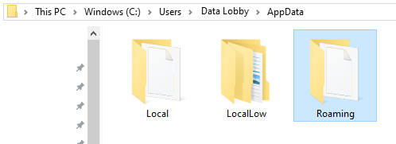
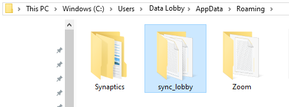

# \(Venu/Done\)"I cannot log in to the Sync Lobby."

## I can't log in to Sync Lobby after the version is updated.

When a new version of Sync Lobby is installed, then there are chances of having the previous versions of data. Therefore, to properly delete or operate the Sync Lobby, you must delete the old version of the data manually.

In this case, please take the following measures. 

### 1.In Windows Explorer, navigate to your account

**C drive \(main drive\) &gt;  Users &gt;  Account \(Windows login account\)**

### 2. Navigate to the AppData folder \(If the file is hidden, check Show hidden in the View tab\)

### **3.   Delete sync\_lobby folder in Roaming folder**

**Note:** If the Sync Lobby is already running, it will not be smoothly deleted. So, please close the Sync Lobby app first and then delete.

We are working on the ways to apply updates without any action.

