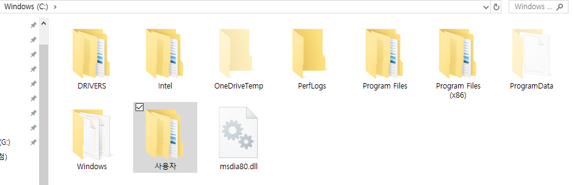
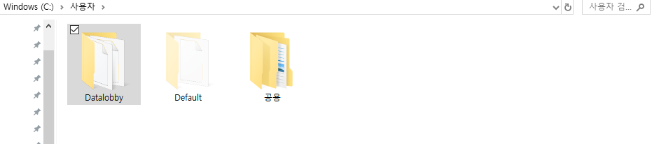
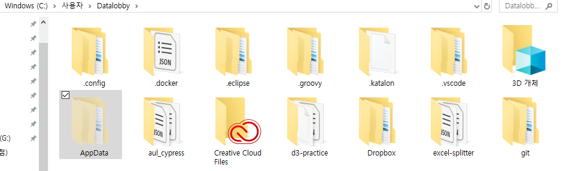
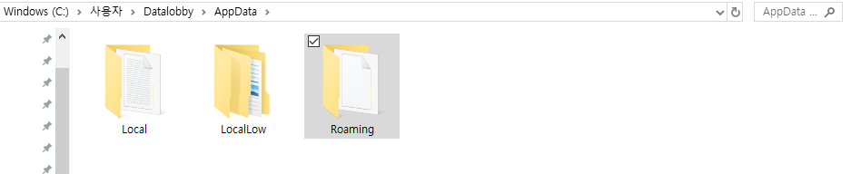
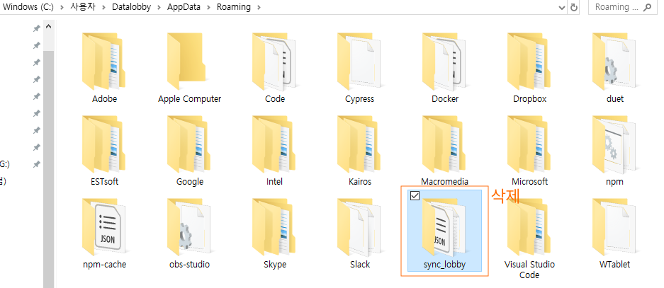

# \(ENG\)"I cannot log into the Sync Lobby."

## 싱크로비 버전이 업데이트 됨에 따라 로그인 할 수 없는 경우

## I can not log in Sync Lobby after version is updated.

As the version of Sync Lobby is updated, a new version of Sync Lobby may not be able to log in normally due to previous versions of data. Therefore, to properly delete or operate the Sync lobby, you must manually delete the old version of the data.

In this case, please take the following measures. 

### 1.In Windows Explorer, navigate to your folder

**C drive \(main drive\) &gt;  Users &gt;  Account \(Windows login account\)**

### 2. Navigate to the AppData folder \(If the file is hidden, check Show hidden in the View tab\)

### **3.   Delete sync\_lobby folder in Roaming folder**

Note: If the program is running, it will not be smoothly deleted.

We are working on ways to apply the update without any action.

