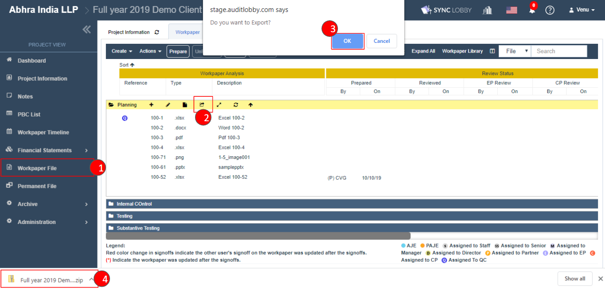
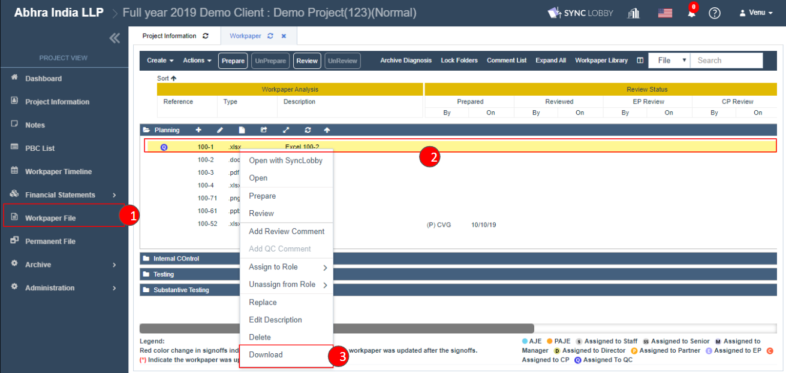

# \(Venu/Done\)"How can I download files from a project?"

There are three ways to download files.

1. Full export of entire files on a screen
2. Download Folder
3. Download individual files

## 1. Full export of entire files on a screen

* Click the 'Workpaper File' option on the Project View left navigation pane.
* Click the 'Actions' menu on the top left of the screen.
* Select the 'Export' option from the list.
* Click the OK button on the confirmation pop-up.
* The entire files of the Workpaper screen will be exported in a zip file format.

## 2. Download Folder

* Click the 'Workpaper File' option on the Project View left navigation pane.
* Select the folder where your file is presented and click the 'Export' icon.
* Click the 'OK' button on the confirmation pop-up.
* The entire files of the Folder will be exported in a zip file format.  

## 3. Download individual files

* Click the 'Workpaper File' option on the Project View left navigation pane.
* Select the folder where your file is presented.
* Right-click the file to see the file context menu options.
* Click the 'Download' option.

