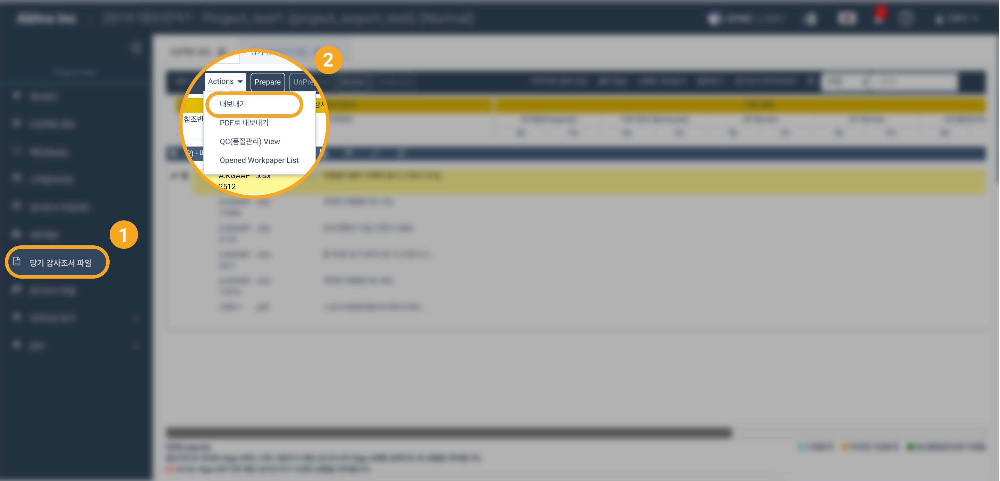

# "프로젝트에서 파일 다운로드는 어떻게 하나요?"

어딧로비에서 3가지 방법으로 감사 조서를 다운로하실 수 있습니다.      

1. 조서 항목 전체 다운로드
2. 폴더 다운로드  
3. 개별 파일 다운로드  

## 1. 조서 항목 전체 다운로드

* Project Home 화면의 왼쪽 메뉴 목록에서 '당기 감사조서 파일'을 선택합니다.
* 좌측 상단의 'Actions' 버튼을 누르면 메뉴가 나타납니다.
* 나타난 메뉴 목록에서 '내보내기'를 선택합니다.

* 팝업창이 나타나면 확인 버튼을 누릅니다.

## 2. 폴더 다운로드  

* Project Home 화면의 왼쪽 메뉴 목록에서 '당기 감사조서 파일'을 선택합니다.  
* 다운로드하고자 하는 폴더를 선택합니다.
* 폴더명 우측의 버튼 중 4번째 버튼을 클릭합니다.  

* 팝업창이 나타나면 확인 버튼을 누릅니다.

## 3. 개별 파일 다운로드 

* Project Home 화면의 왼쪽 메뉴 목록에서 '당기 감사조서 파일'을 선택합니다.  
* 다운로드하고자 하는 파일의 폴더를 클릭하면 파일들이 나타납니다.
* 파일 목록중 다운로드할 파일을 더블클릭합니다.
* 파일이 열리면 좌측 상단의 Download 버튼을 클릭합니다. 


####  파일을 열지 않고 다운로드하는 방법이 7월 업데이트에 포함될 예정입니다.  


