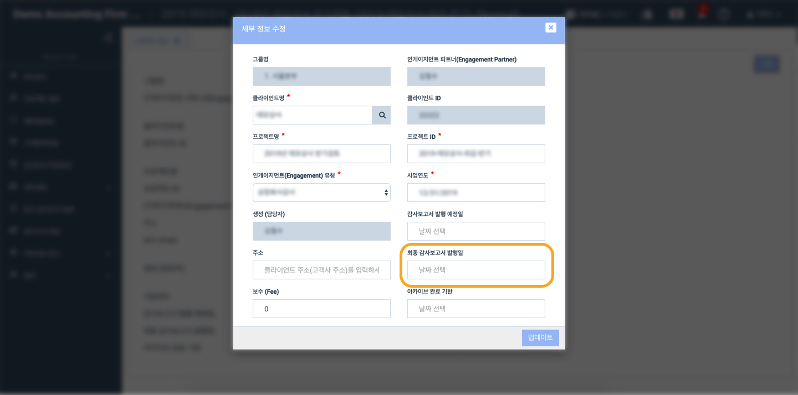

# \(ENG\)"How can I change the final issuance date?"


Only the user who has admin authority can edit the project information.


1. Go to Project Information.
2. Click Edit on the right side of the  project information screen.

1. You can change the information of final issuance date
2. Click update button to save the edited information

