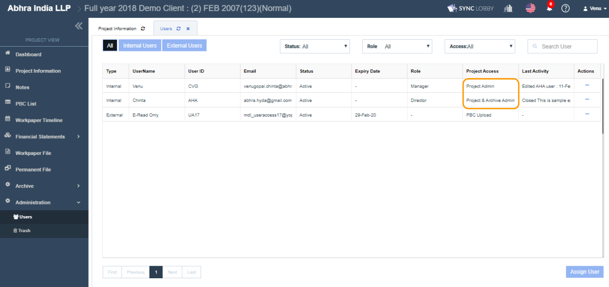

# \(Venu/Done\)"How can I change the Final Issuance Date?"


Only the user who is a 'Project & Archive Admin' and 'Project Admin' can edit the project information.


1. Visit the project that you wish to update the 'Final Issuance Date'.
2. Click the 'Project Information' left navigation menu of the 'Project View'.
3. Click the 'Edit' button on the right side of the screen.
4. Input/Revise the information for the 'Final Issuance Date'.
5. Click the 'Update' button to save the edited information.

