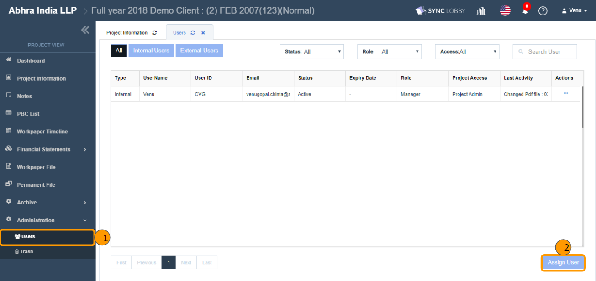

# \(Venu/Done\)"How can I assign the archive admin to a project?"

1. Click the 'Administration' on the left menu menu of the 'Project View'.
2. Click the 'Users' button under 'Administration'.
3. Click the 'Assign User' button at the bottom right of the page.

The 'Project Access Type' is a field where you set the level of authority in the project.

## 1. Project & Archive Admin 

* The user who is set with the 'Project & Archive Admin' will have complete control over the project.
* The user gets the project manager authority
* The user gets the authority to archive the project.
* The user has more crucial permissions within the project and can do anything within the project.
* The major permissions are:
  * Archive the project.
  * Assign, Edit, Deactivate/ Activate, Unassign the user.
  * Edit the Project Information.
  * Lock/ Unlock the project.
  * Permanent delete the trashed items.
  * Force close the opened workpaper or permanent files.
  * Delete the Review Comments on behalf of other users.

## 2. Project Admin

* The user gets the project manager authority.
* The user **cannot** archive the project.
* The major permissions are:
  * Archive the project.
  * Assign, Edit, Deactivate/ Activate, Unassign the user.
  * Edit the Project Information.
  * Lock/ Unlock the project.
  * Permanent delete the trashed items.
  * Force close the opened workpaper or permanent files.
  * Delete the Review Comments on behalf of other users.

## 3. Project User 

* The 'Project User' doesn’t have access to any of the above permissions.
* The user can create and edit a workpaper.
* The user can sign off a workpaper.
* The user **cannot** archive the project.

