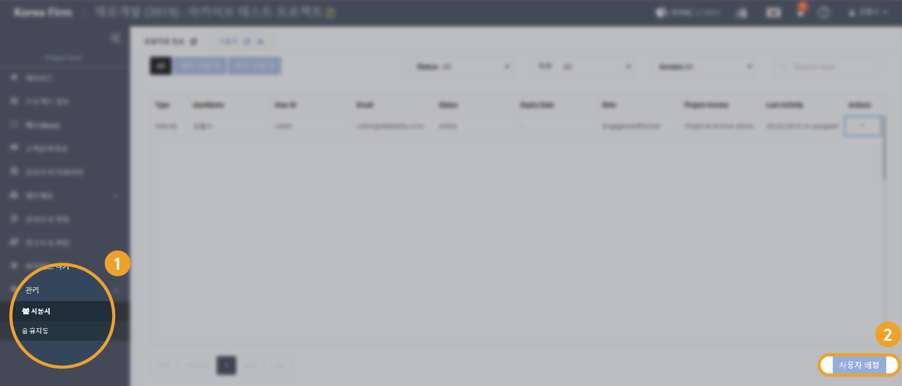

# "프로젝트 내부에서 Archive Admin을 설정하고 싶습니다."

1. 프로젝트용 메뉴 목록에서 '관리\(Administration\)' 를 선택합니다. 
2. '관리' 메뉴의 하위 항목인 '사용자'를 선택합니다. 
3. '관리 &gt; 사용자' 화면의 오른쪽 아래에서 '사용자 배정' 버튼을 누릅니다. 

프로젝트 내부의 실질적인 권한을 조정하는 부분입니다.  

#### 1. Project & Archive Admin 

* 프로젝트 관리자인 동시에 아카이브 권한을 가지게 됩니다. 
* 프로젝트 관리자의 권한을 가집니다. 
* 아카이브를 하거나 아카이브를 해제할 수 있습니다. 

#### 2. Project Admin

* 프로젝트 관리자의 권한을 가집니다. 
  * 사용자를 프로젝트에 추가하거나 배제할 수 있습니다. \(assign / unassign\) 
* 프로젝트를 아카이브 할 수 없습니다. 

#### 3. Project User 

* 프로젝트 참여자입니다. 
  * 조서를 생성하거나 수정할 수 있습니다. 
  * 조서를 사인오프 할 수 있습니다. 
* 프로젝트를 아카이브 할 수 없습니다.   

