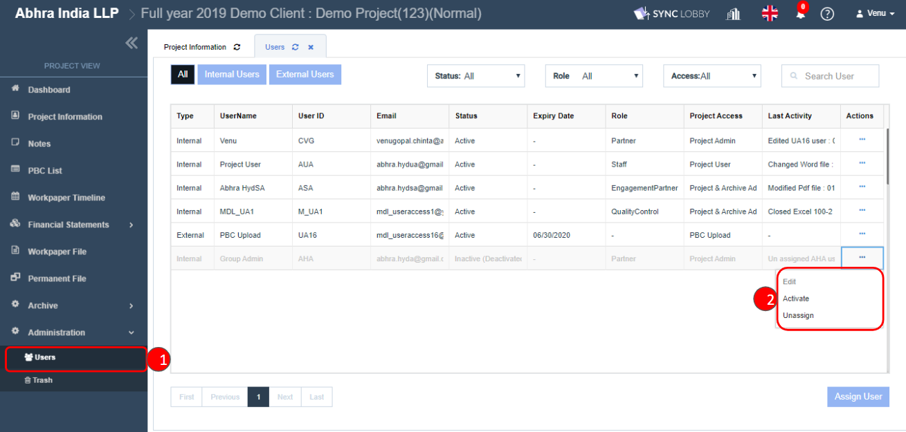
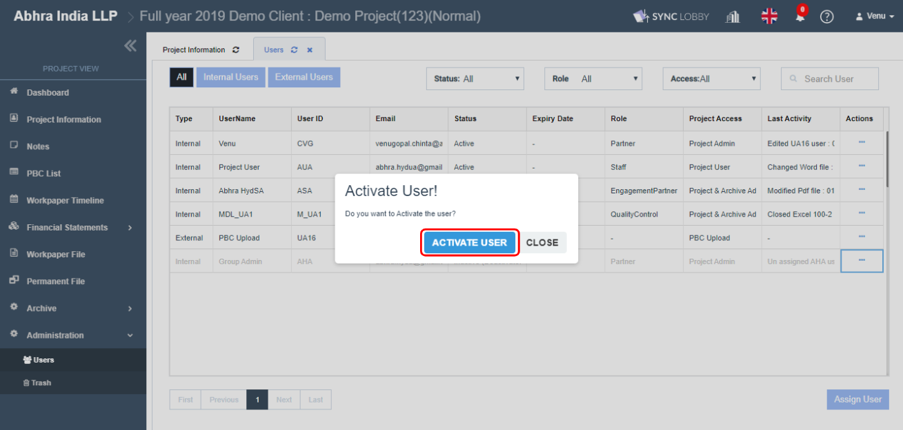
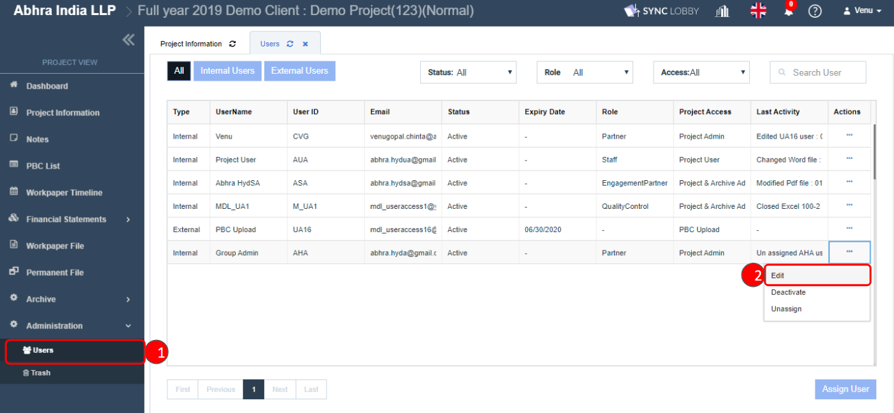
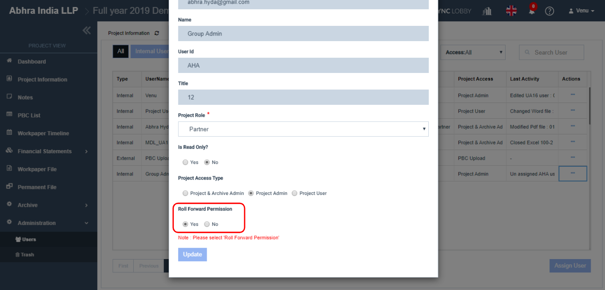
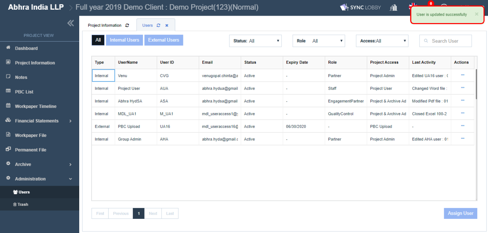

# \(Venu/Done\)"I can't find the project while trying to Roll Forward"

## Cause of the issue

There are two main reasons why a project does not appear in the Roll Forward drop-down.

> When the user is Inactive in the project.
>
> When the project Roll Forward Permission is set to NO to the user.

Either of the above may be the cause or in some cases, both might be applied. If this happens, both problems need to be identified. The verification process is outlined below.

## 1.When the user is Inactive in the project

1. Visit the project.
2. Open "Administration &gt; Users" screen.
3. Click the three dots button to the right of the user you want to grant Roll Forward Privilege to.
4. Clicking the Activate button opens the 'Activate User!' pop-up.

Clicking the 'ACTIVATE USER' button activates the user.

After enabling the user, check the Roll Forward permission.

## 2.When the project Roll Forward Permission is set to NO to the user

1. Visit the project.
2. Open "Administration &gt; Users" screen.
3. Click the three dots button to the right of the user you want to grant Roll Forward Privilege to.
4. Clicking the 'Edit' button opens the 'Edit User' pop-up.

Set the 'Roll Forward Permission' to 'Yes'.

After reviewing both methods, check if the project to be rolled over is active in the Roll Forward drop-down.

