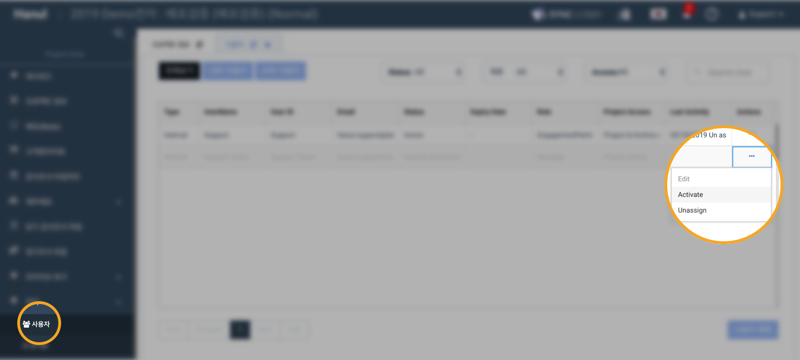
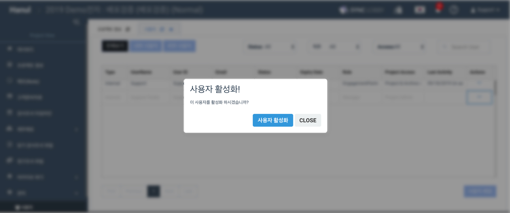
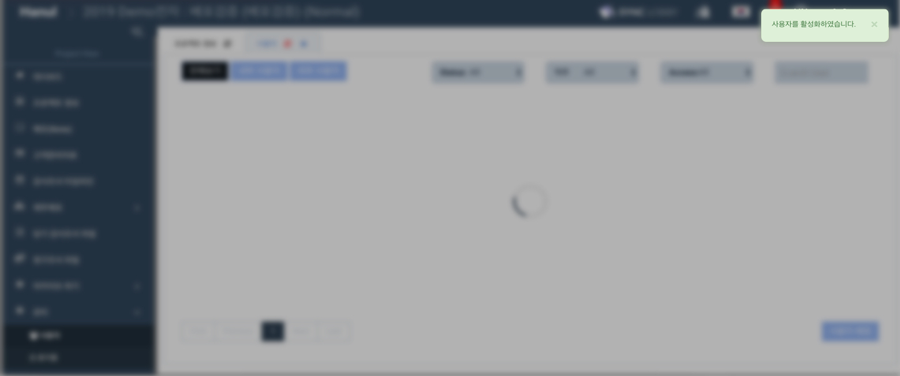
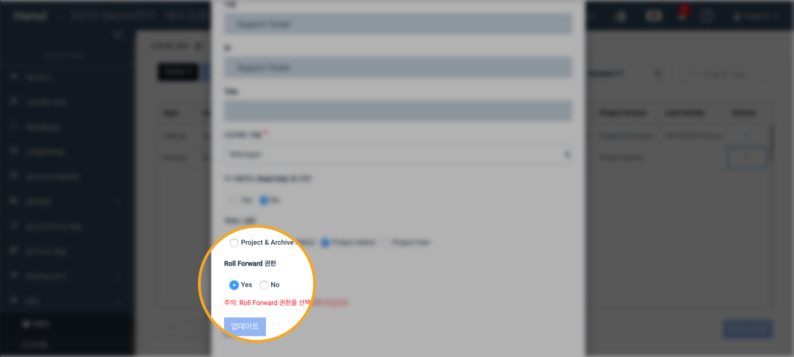
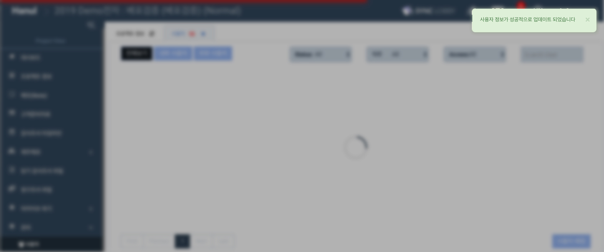

# \(ENG\)"롤 포워드 하려고 하는데 프로젝트가 안 보여요"\(관리자용\)

## 해당 현상의 원인

프로젝트 생성시 롤포워드 프로젝트가 목록에 보이지 않는 이유는 크게 두 가지가 있습니다.

> 유저에게 해당 프로젝트 롤 포워드 권한이 No 로 설정되어 있는 경우
>
> 해당 프로젝트에 유저가 비활성화 되어 있는 경우

두 가지 중 하나가 원인일 수도 있고 두 가지 원인이 다 적용된 경우도 있습니다. 해당 현상이 일어나는 경우 두 가지 원인 모두 확인이 필요합니다. 확인 절차는 아래에 안내되어 있습니다.

## 1.유저가 Deactivate 되어 있는 경우

1. 해당 프로젝트에 들어갑니다.
2. 롤 포워드 권한을 주고자 하는 유저의 우측에 있는 삼점 버튼을 클릭합니다.
3. Activate 버튼을 누릅니다.

사용자 활성화 버튼을 누릅니다.

사용자를 활성화 시킨 후에 롤 포워드 권한을 확인합니다.

## 2.유저에게 롤포워드 권한이 없는 경우

1. 해당 프로젝트에 들어갑니다.
2. 롤 포워드 권한을 주고자 하는 유저의 우측에 있는 삼점 버튼을 클릭합니다.
3. Edit 버튼을 누릅니다.

Role forward 권한을 yes 로 설정합니다.

두 가지 방법을 모두 확인하신 후에 프로젝트 생성 창에서 롤포워드 할 프로젝트가 활성화 되어있는지 확인 부탁드립니다.

