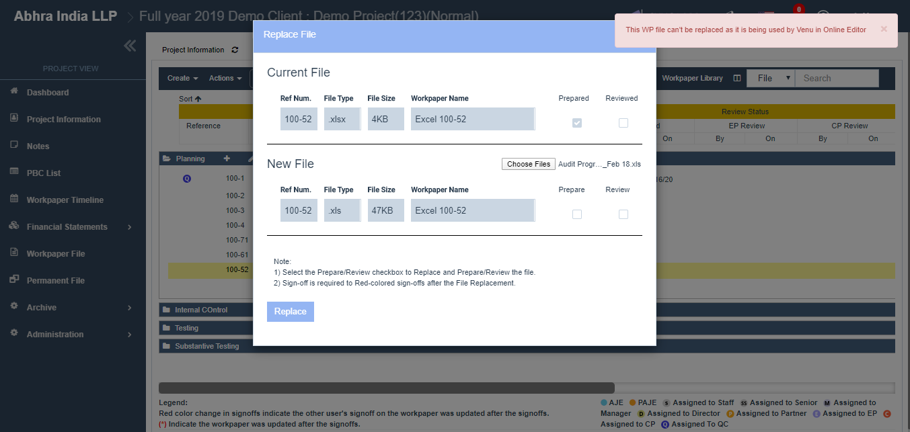
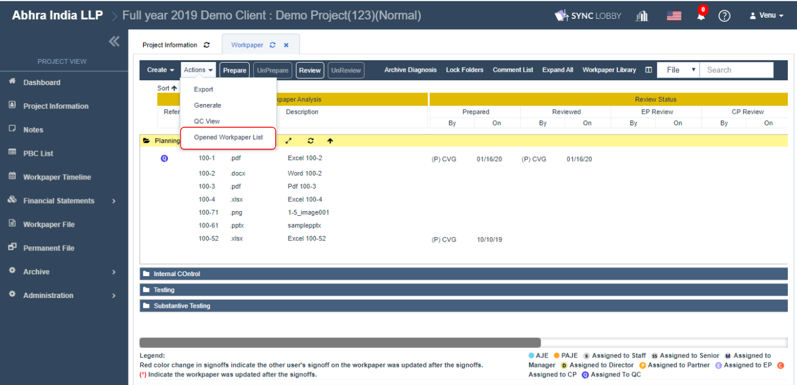
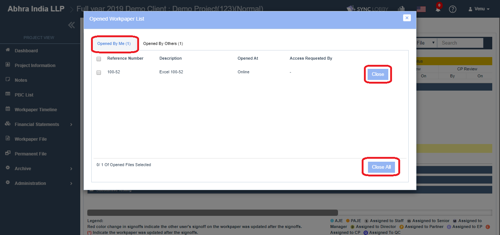
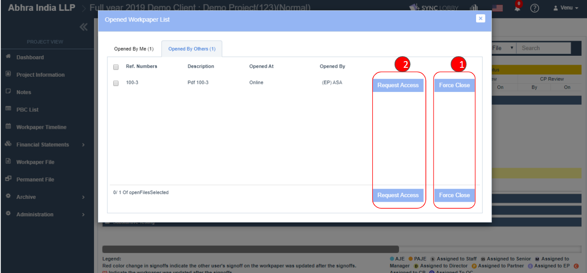

# \(Venu/Done\)"The audit file is being used in an online editor and cannot be replaced."

‌If you see the message "This WP file can't be replaced as it is being used by xxx in Online Editor", you may be running the file in the background even if the audit file window is not opened. You will need to close the online editor completely.

* You can use the Opened file management function by clicking 'Actions &gt; Opened Workpaper List' button.

If the file is opened by you, then you can see the file in the 'Opened By Me' tab and close the file by clicking the 'Close' or 'Close All' button in the popup.

You can see the files opened by others in the 'Opened By Others' tab.

1. If you are an Admin user, then you can force the file\(s\) by using 'Force Close' button.
2. If you are not an Admin user, then you can request the file opened user to close the file using the 'Request Access' button.

