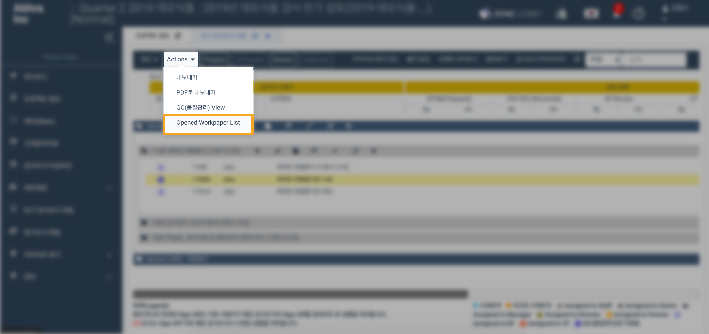

# "감사 조서 파일이 온라인 에디터에서 사용되고 있어서 교체가 되지 않아요."

‌  "이 감사조서 파일은 온라인 에디터에서 사용되고 있습니다. 따라서 대체할 수 없습니다."는 메세지가 보이는 경우, 감사 조서 파일 창은 켜져 있지 않아도 보이지 않는 배경에서 동작하고 있는 경우가 있습니다. 이 경우 온라인 에디터를 완전히 닫아주시는 작업이 필요합니다.

* 당기감사조서 메뉴의 Actions -&gt; 'Opened workpaper list' 버튼을 눌러서 열린 파일 관리 기능을 사용하실 수 있습니다.

 팝업 창에서 온라인 에디터로 열려 있는 화면을 '닫기' 버튼을 눌러서 닫으실 수 있습니다.

