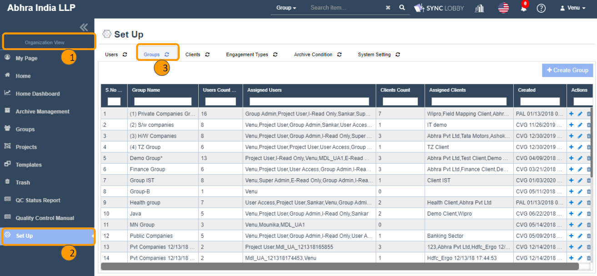
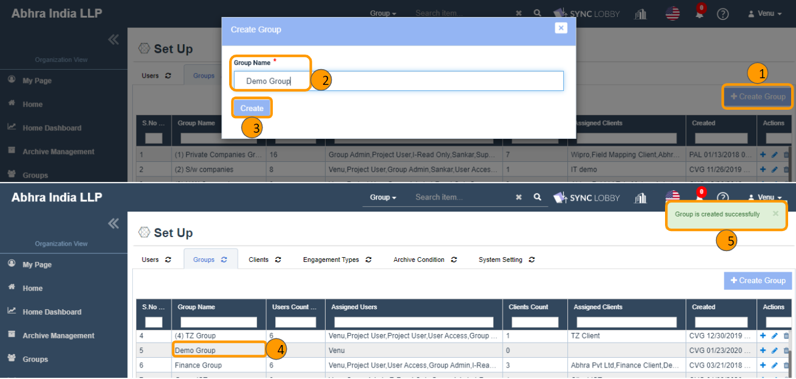
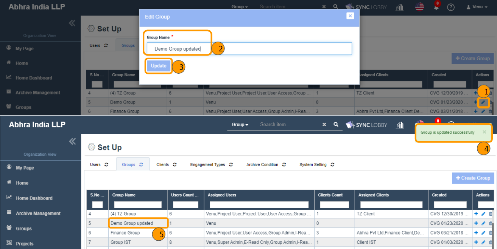
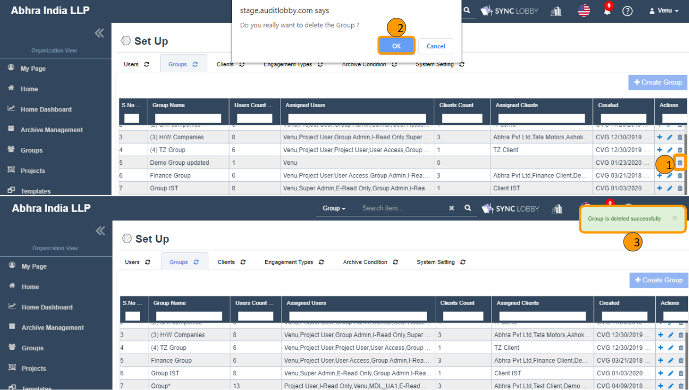
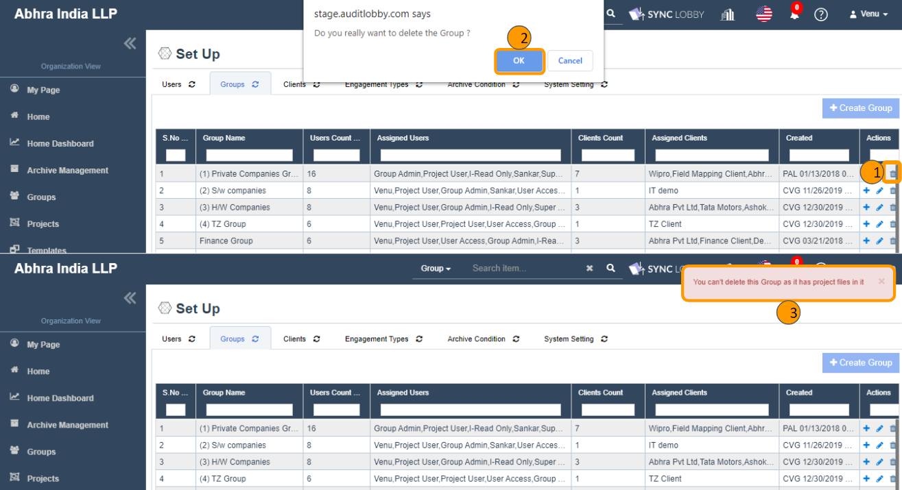
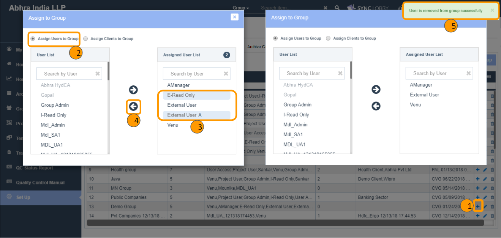
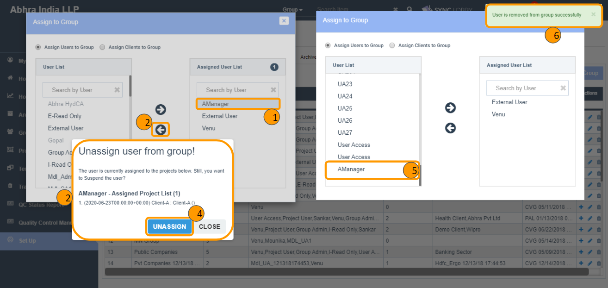
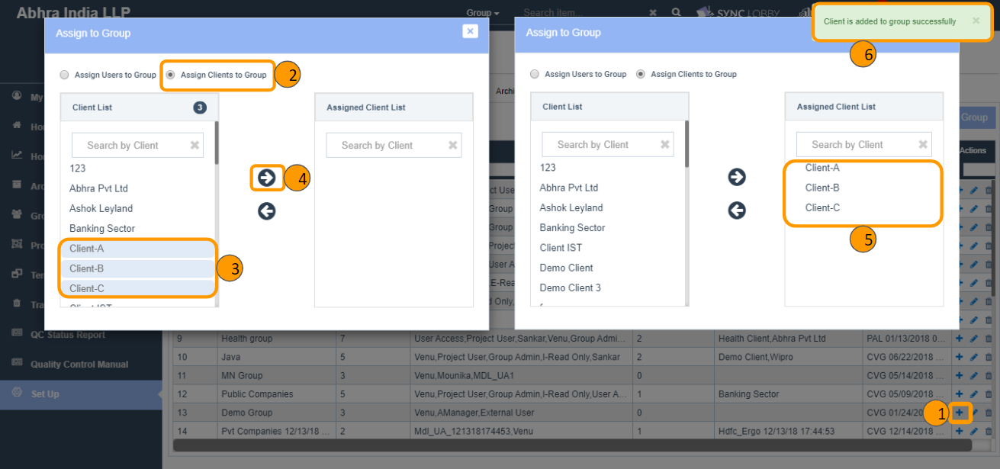
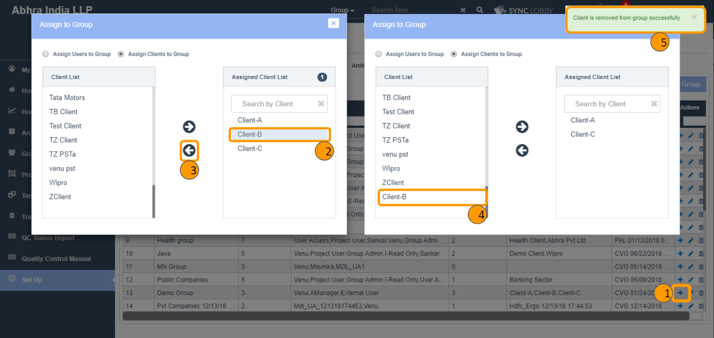
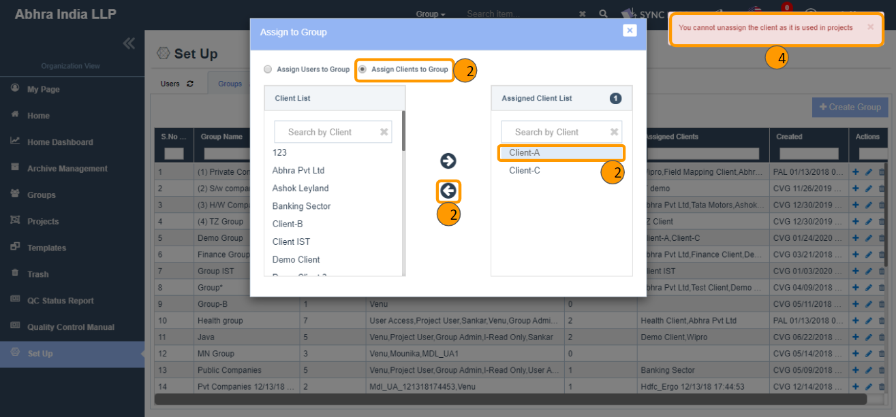

# \(Venu/Done\) Groups \(Set Up &gt; Groups\)

## Summary

1. The Groups screen can be accessed by both Super Admin and Group Admin users only.
2. The actions like create, edit, delete can be performed only by the Super Admin.
3. Both SA and GA can
   * Assign/unassign users to/from the group.
   * Assign/unassign clients to/from the group.
4. The restriction of project access to users revolves around the assign or unassign the user or client to the group.

### Major components of Groups module

1. Create Group
2. Edit Group
3. Delete Group
4. Assign/ Unassign Users to Group
5. Assign/ Unassign Clients to Group

## 1. Create Group

1. Click the 'Set Up' button from the left navigation menu of the Organization View.
2. Click the 'Groups' tab at the top of the 'Set Up' page.
3. Clicking the ‘Create Group’ button displays the ‘Create Group’ dialog.
4. Enter the name of the group.
5. Clicking the 'Create' button adds the group to screen.


Duplicate groups won't be allowed while adding a group.


## 2. Edit Group

1. Locate the group that you wish to edit.
2. Clicking the ‘Edit’ icon displays the ‘Edit Group’ dialog.
3. Enter the revised name of the group and clicking the 'Update' button updates the group name.


Duplicate groups won't be allowed while editing a group.


## 3. Delete Group

1. Locate the group that you wish to delete.
2. Clicking the ‘Delete’ icon displays the delete confirmation alert.
3. Clicking the 'OK' button in the confirmation alert deletes the group.
4. Deleted groups can be restored from the 'Trash' screen.


NOTE: A group cannot be deleted when it has at least one project.


## 4. Assign/ Unassign Users to Group

1. Super Admin & Group Admin have access to assign/unassign users to Group.
2. Locate the group that you wish to assign users to it.
3. Click the ‘Add Users/Clients to Group’ plus icon under the 'Actions' column.
4. The ‘Assign to Group’ dialog will be displayed.
5. Select the 'Assign Users to Group' radio button.
6. The LHS side of the dialog shows not assigned users of the group and RHS side shows assigned users of the group.
7. Select one or more users on the LHS side and clicking the right arrow assigns the users to the Group.
8. With this assignment, not all users of the Organization would be displayed under the ‘Administration &gt; Users &gt; Assign User’ dialog, instead, admins can see only the assigned users to the respective Group in which the current project is located.
9. Select one or more users on the RHS side and clicking the left arrow unassigns the users from the Group.


In the 'Assign Users to Group' dialog,

* Suspended \(disabled\) users get displayed but grayed-out, so they cannot be selected.
* Removed \(deleted\) users won't be displayed.



When a user is assigned to at least one project under the current group, then while unassign the user from the group notifies the list of assigned projects for the double confirmation.


## 5. Assign/ Unassign Clients to Group

1. Super Admin & Group Admin have access to assign/unassign clients to Group.
2. Locate the group that you wish to assign clients to it.
3. Click the ‘Add Users/Clients to Group’ plus icon under the 'Actions' column.
4. The ‘Assign to Group’ dialog will be displayed.
5. Select the 'Assign Clients to Group' radio button.
6. The LHS side of the dialog shows not assigned clients of the group and RHS side shows assigned clients of the group.
7. Select one or more clients on the LHS side and clicking the right arrow assigns the clients to the Group.
8. With this assignment, not all clients of the organization would be displayed in the ‘Create Project’ or ‘Edit Project Information’ dialogs, instead, admins can view only the assigned clients to the respective Group.
9. Select one or more clients on the RHS side and clicking the left arrow unassigns the clients from the Group.


When a client is associated with at least one project under the current group, then you cannot unassign the client from the group.


