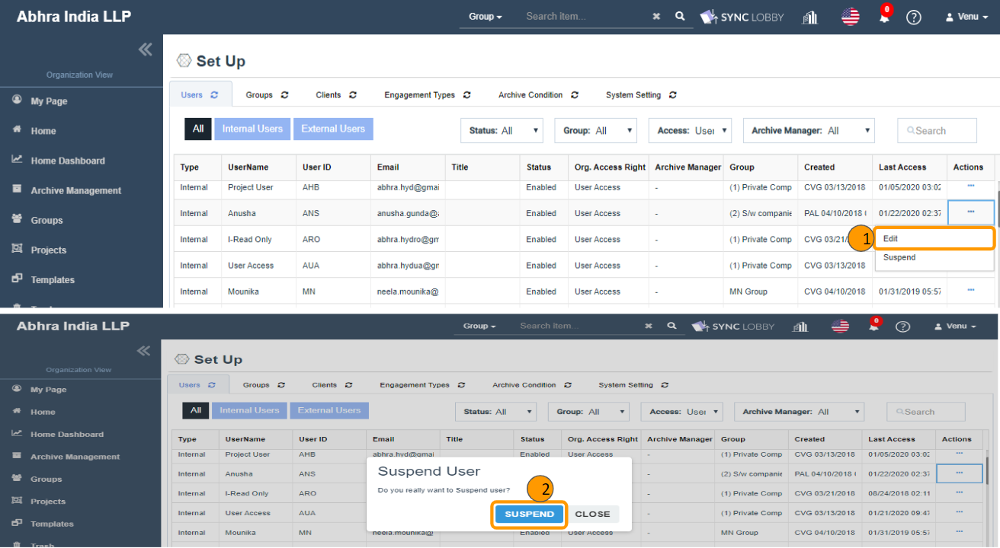
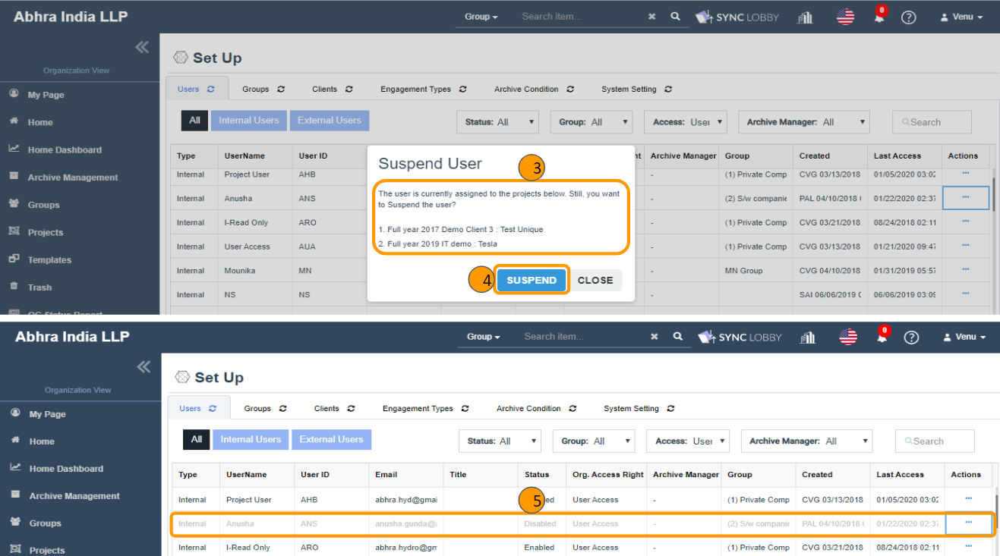
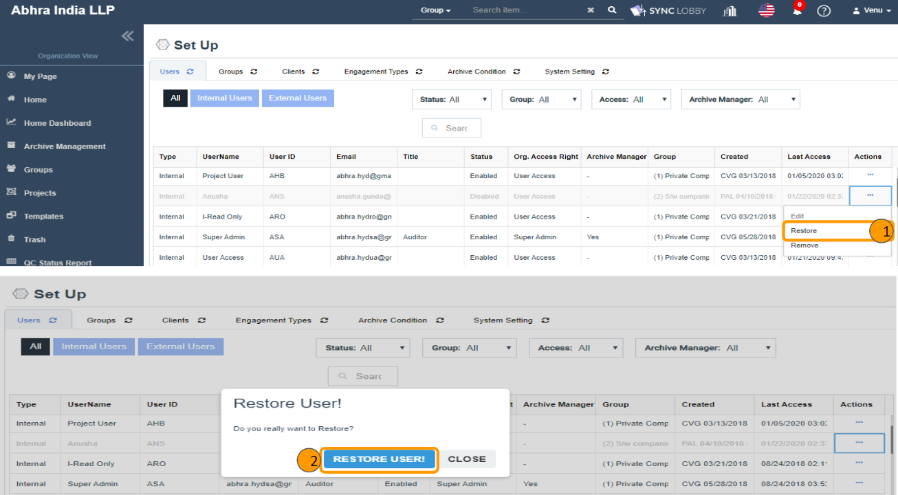
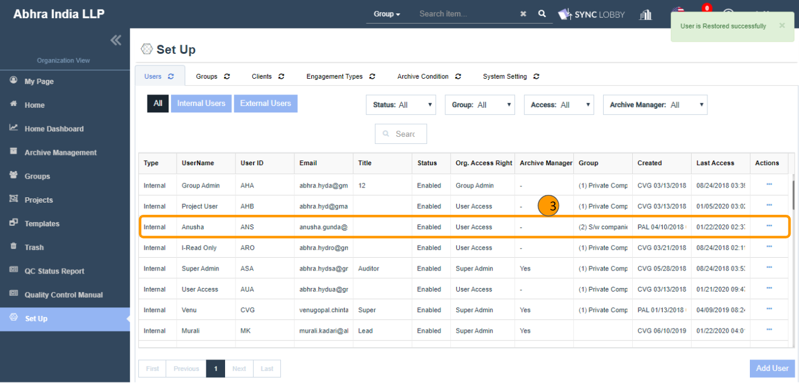
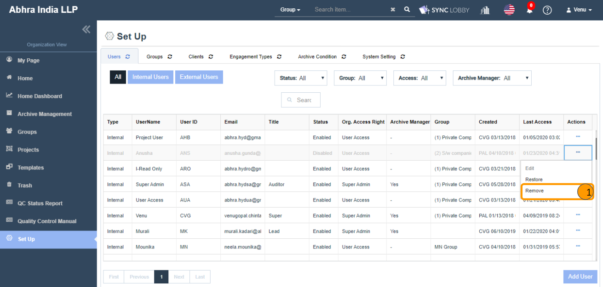
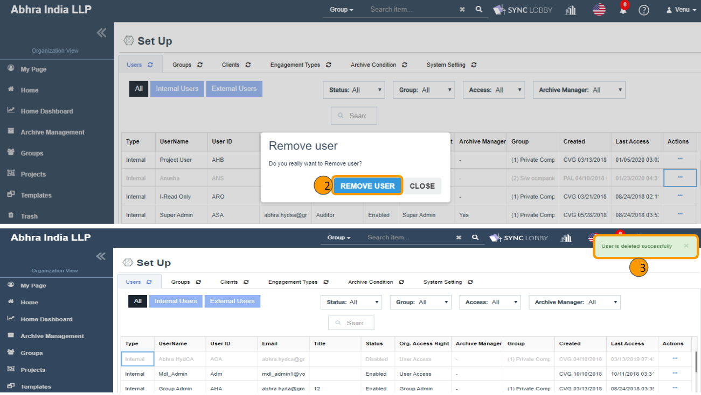
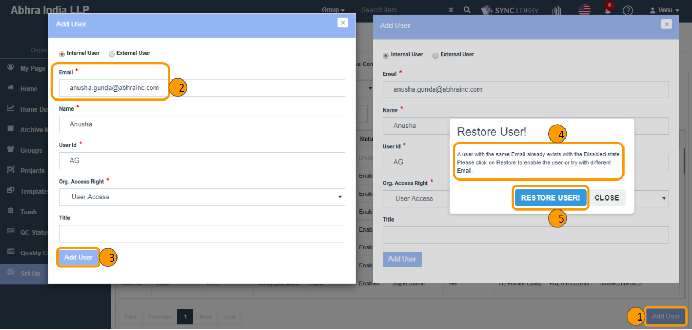

# \(Venu/Done\) Organization Users \(Set UP &gt; Users\)

## Summary

The CPA \(Certified Public Accountant\) Firm must control who can create projects and who can access projects. Therefore, before a project can be created, the CPA firm must first designate users that can access ALL projects or Group level only.

* Admin users can view the ‘Set Up’ option on the left navigation pane of Organization View.
* Clicking it navigates the user to the ‘Set Up’ screen and contains five tabs named ‘Users, Groups, Clients, Engagement Types, Archive Condition, System Settings’.
* The default selection is the 'Users' tab and using this module, the admin users can perform add, update, delete operations on users.
* The email id which is submitted while creating your organization acts as a Super Admin and Archive Manager for your firm.


**NOTE:** 'Set Up &gt; Users' module can be accessed only by Super Admin and Group Admin users, but the operations like add, update, suspend, remove operations can be done by the Super Admin user only.


### Major components of Users feature

1. Two types of users.
   1. Internal Users
   2. External Users
2. Three types of Organization access rights.
   1. Super Admin \(SA\)
   2. Group Admin \(GA\)
   3. User Access \(UA\)
3. Add User.
4. Edit User.
5. Suspend \(Disable\) User.
6. Restore \(Enable\) User
7. Remove \(Delete\) User.

## 1. Types of Users

> There are two types of users in a firm such as Internal Users and External Users.

### 1.1. Internal Users

* Internal users are the primary users of application and examples are Owners, Managers, Employees who do an audit. Internal User is nothing but a Regular auditor inside the firm.

### 1.2. External Users

* External users are the secondary users of accounting and examples are Client users, Investors, Customers, Tax Authorities, Government, External Auditors, Inspectors/Regulators  who inspect the auditing.
* While adding or updating the user, you can set the user type as Internal or External.

## 2. **Types of Organization access rights**

> There are three access rights in Internal Users named Super Admin \(SA\), Group Admin \(GA\), and User Access \(UA\).

### 2.1. Super Admin \(SA\)

* The Super Admin has full administrative authority for everything in the organization.
* SA has access to the following modules on the Organization View and able to perform affordable actions on the screen.
  * My Page \(Recently Visited Projects, Assigned Projects\)
  * Home
  * Home Dashboard
  * Groups
  * Projects
  * Templates
  * Trash
  * QC Status Report
  * Quality Control Manual
  * Set Up \(Users, Groups, Clients, Engagement Types, Archive Condition, System Settings\)
* The Super Admin who is an 'Archive Manager' can only see the 'Archive Management' option in the left navigation menu of Organization View.

### 2.2. Group Admin \(GA\)

* The Group Admin has full administrative authority in the respective assigned Groups.
* GA has access to the following modules on the Organization View and except Groups \(LHS Groups\), the other modules will be in a read-only mode to him.
  * My Page \(Recently Visited Projects, Assigned Projects\)
  * Home
  * Home Dashboard
  * Groups
  * Projects
  * Templates
  * Trash
  * QC Status Report
  * Quality Control Manual
  * Set Up \(Users, Groups, Clients, Engagement Types, Archive Condition, System Settings\)

### 2.3. User Access \(UA\)

* In general, the User Access permission will be given to the users who are regular auditors of a project.
* User Access person has read-only access to the following modules on the Organization View.
  * My Page \(Recently Visited Projects, Assigned Projects\)
  * Home
  * Home Dashboard
  * Groups
  * Projects
  * QC Status Report
  * Quality Control Manual


**NOTE:** The above access rights are only for Internal Users and External Users doesn't contain any organization access rights & they only can view two left navigation menu options named 'My Page' and 'Projects'.


## 3. Add User

1. Only Super Admin has access to add users.
2. Click the 'Add User' button.
3. The 'Add User' dialog will be opened where Internal or External users can be added.
4. The following fields will be displayed when the 'Internal User' radio button is selected.
   * Email\*, Name\*, User Id\*, Org. Access Right\*, Archive Manager\*, Title.
5. The following fields will be displayed when the 'External User' radio button is selected.
   * Email\*, Name\*, User Id\*, Title\*.
6. The 'Org. Access Right' drop-down contains three values "Super Admin, Group Admin, User Access". Select intended one among the three.
7. Click the 'Add User' button in the Add User dialog.
   * You can view the success message on the top-right of the screen.
   * The user will be added to your organization.
   * The invited user would receive two email notifications.
8. The new user has to,
   * Confirm their Email id first.
   * And then, log in to the application using the temporary password.
   * Can update the temporary password using the Change Password feature.

### 3.1. Provide Archive Manager permission

If you are an Archive Manager, then only you can provide 'Archive Manager' permissions to others.

1. The 'Archive Manager' permission is given only to the Super Admin users.
2. The 'Archive Manager' field with the 'Yes/ No' options gets displayed upon choosing the 'Super Admin' value in the 'Org. Access Right' drop-down.


Duplicate Email and User Id won't be allowed while adding a user.



At least one Archive Manager should exist in the Organization.


## 4. Edit User

Using this, the user information can be updated. Only Super Admin has access to update the user's information.

1. Click the three dots button of the user that you wish to update.
2. A list of action items will be displayed.
3. Click the 'Edit' option.
4. The 'Edit User' dialog will be displayed.
5. Revise the user information as required.
   * Please note that you can't change the 'Email' information.
6. Duplicate User Id won't be allowed while updating a user.


Super Admin who is an Archive Manager cannot be downgraded to Group Admin or User Access until the ‘Archive Manager’ permission gets removed.

* First, remove the 'Archive Manager' permission.
* And then downgrade to Group Admin or User Access.



If a user assigned to at least one project, then updating the user type from Internal to External \[or\] External to Internal is not possible.

You can update the user type only after unassiging the user from all assigned projects.


## 5. Suspend \(Disable\) User

> Using this, you can disable your organization access to the user temporarily. Only Super Admin has access to disable the user information.

1. Click the three dots button of the user that you wish to Suspend.
2. A list of action items will be displayed.
3. Click the 'Suspend' option.
4. The 'Suspend User' confirmation dialog will be displayed.
5. If a user is assigned to at least one project, then one more additional confirmation alert gets displayed that shows the list of assigned projects to the user.
6. The \#4 will be skipped if the user is NOT assigned to any project.
7. Click the 'SUSPEND' button in the confirmation to disable the user. Here, After the user Suspend,
   * The status of the user gets changed to Disabled from the Enabled.
   * Yet, you can see the user record on the screen with a grayed-out color.
   * Yet, the user record will be displayed on the 'Administration &gt; Users' screen of all assigned projects in the Project View, but the status is changed to 'Inactive'.
8. Suspended users can't log in to the application.

## 6. Restore \(Enable\) User

> Using this, you can restore the user who got suspended, so that the user will be an active user in your firm.

1. Click the three dots button of the user that you wish to Restore.
2. A list of action items will be displayed.
3. Clicking the 'Restore' option displays the 'Restore User!' confirmation dialog.
4. Clicking the 'RESTORE USER' button in the confirmation alert restores the user. i.e., After the user restore,
   * The status of the user changes to Enabled from the Disabled.
   * The user record turns to normal color from the gray color.
   * Still, the status of the user is 'Inactive' if in case he was assigned to any project\(s\) during the Suspend time.

## 7. Remove \(Delete\) User

> Using this, you can remove your organization access to the user permanently. Only Super Admin has access to remove the user.

1. In order to remove a user from the Organization, first the user needs to be Suspended.
2. Click the three dots button of the user that you wish to remove.
3. A list of action items will be displayed.
4. Clicking the 'Remove' option displays the 'Remove User' confirmation dialog.
5. Clicking the 'REMOVE' button in the confirmation alert removes \(disappears\) the user from the 'Users' screen.


When you try to add an user with the deleted user's email id, then an alert will be prompted to you saying that "A user with the same Email already existed in the Deleted status. Please click on Restore User to enable the user or try with different Email.".

* Click the 'Restore User' button to activate the user. \[OR\]
* Change the email id and click the 'Add User' button again.


