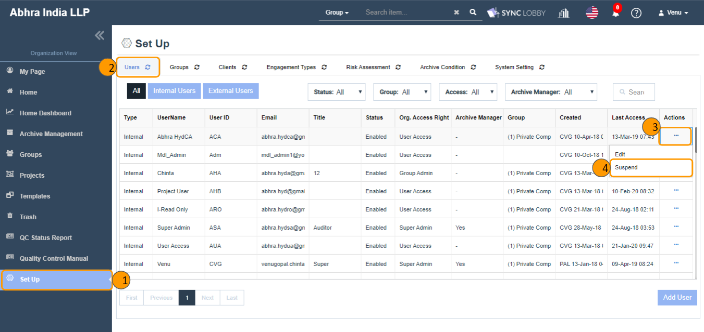

# \(Venu/Pending\) Organization Users \(Set UP &gt; Users\)

The CPA \(Certified Public Accountant\) Firm must control who can create projects and who can access projects. Therefore, before a project can be created, the CPA firm must first designate users that can access ALL projects or Group level only.

Users can view the ‘Set Up’ option on the left navigation pane of Organization View. This can be accessed only by Super Admin and Group Admin users. Clicking it navigates the user to the ‘Set Up’ screen and contains five tabs named ‘Users, Groups, Clients, Engagement Types, Archive Condition, System Settings’. The default selection is the 'Users' tab and using this module, the admin users can perform add, update, delete operations on users.

## Summary View of Organization Users

1. Add, Edit, Suspend, and Remove users.
2. Three types of Organization access rights existed.
   1. Super Admin
   2. Group Admin
   3. User Access
3. Two types of users can be created.
   1. Internal Users
   2. External Users

## Add Users

1. While creating or updating the user, the SA user should see two radio button options \(When one option is selected the other should be disabled and vice-versa\) such as Internal User and External User.
   1. Example: Internal User is nothing but a Regular auditor inside the firm and External Users are Inspectors/Regulators or Client users
2. Reword Access Type to Organization Access Right \(Both on Create & Edit User screens\)
3. Reword the text Create to Add while adding user to the Organization
4. Include a free text field Title on both Create & Edit User screens such as optional field in the Internal User section and mandatory in the External User section
5. The following filter options should be available on the screen
   1. All &lt;tab&gt;
   2. Internal User &lt;tab&gt;
   3. External User &lt;tab&gt;
   4. Status \(Enabled/Disabled/All\) - Default is set to ‘All’
   5. Group \(list of all groups /All\) - Default is set to ‘All’
      1. List of all groups to SA
      2. List of assigned groups to GA
      3. Access Right \(list of Organization access rights/All\) - Default is set to ‘All’
      4. Archive Manager \(Yes/ No/All\) - Default is set to ‘All’
6. By default, the tab All should be selected \(i.e. Internal and External users of status Enabled/Disabled should be displayed\)
7. In addition to the already existing fields, the following fields should be displayed in a tabular format. The fields order is Select all checkbox, S.No., Type, User Name, User ID, Email, Title, Status, Org. Access Right, Archive Manager, Groups, Created, Last Access, Actions \(three dots\) \(React JS R&D\)
   1. Checkbox &lt;to select all records with a single click&gt;
   2. Type &lt;Type of the user such as Internal/ External&gt;
   3. Status &lt;Status of the user: Enabled/ Disabled&gt;
   4. Archive Manager
      1. If the user is a archive manager, then display the label as ‘Yes’
      2. If not a archive manager, display hyphen ‘-’
      3. Groups &lt;Reword ‘Assigned Groups’ to ‘Groups’&gt;
      4. Last Access &lt;Last logged-in date & time stamp of the user&gt;
      5. Actions &lt;Three dots \(. . .\), clicking it should display Edit, Details, View History, Suspend/Restore, Remove options&gt;

