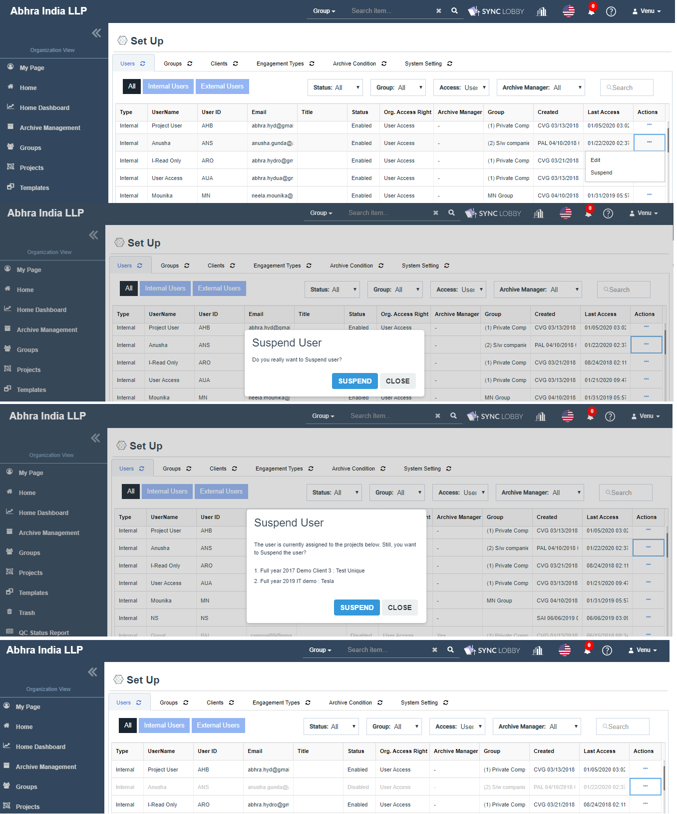

# \(Venu/Pending\) Organization Users \(Set UP &gt; Users\)

The CPA \(Certified Public Accountant\) Firm must control who can create projects and who can access projects. Therefore, before a project can be created, the CPA firm must first designate users that can access ALL projects or Group level only.

* Admin users can view the ‘Set Up’ option on the left navigation pane of Organization View.
* Clicking it navigates the user to the ‘Set Up’ screen and contains five tabs named ‘Users, Groups, Clients, Engagement Types, Archive Condition, System Settings’.
* The default selection is the 'Users' tab and using this module, the admin users can perform add, update, delete operations on users.


**NOTE:** 'Set Up &gt; Users' module can be accessed only by Super Admin and Group Admin users, but the operations like add, update, suspend, remove operations can be done by the Super Admin user only.


## Summary View

1. Two types of users.
   1. Internal Users
   2. External Users
2. Three types of Organization access rights.
   1. Super Admin \(SA\)
   2. Group Admin \(GA\)
   3. User Access \(UA\)
3. Add User.
4. Edit User.
5. Suspend User.
6. Remove User.

## 1. Types of Users

> There are two types of users in a firm such as Internal Users and External Users.

### 1.1. Internal Users

* Internal users are the primary users of application and examples are Owners, Managers, Employees who do an audit. Internal User is nothing but a Regular auditor inside the firm.

### 1.2. External Users

* External users are the secondary users of accounting and examples are Client users, Investors, Customers, Tax Authorities, Government, External Auditors, Inspectors/Regulators  who inspect the auditing.
* While adding or updating the user, you can set the user type as Internal or External.

## 2. **Types of Organization access rights**

> There are three access rights in Internal Users named Super Admin \(SA\), Group Admin \(GA\), and User Access \(UA\).

### 2.1. Super Admin \(SA\)

* The Super Admin has full administrative authority for everything in the organization.
* SA has access to the following modules on the Organization View and able to perform affordable actions on the screen.
  * My Page \(Recently Visited Projects, Assigned Projects\)
  * Home
  * Home Dashboard
  * Groups
  * Projects
  * Templates
  * Trash
  * QC Status Report
  * Quality Control Manual
  * Set Up \(Users, Groups, Clients, Engagement Types, Archive Condition, System Settings\)
* The Super Admin who is an 'Archive Manager' can only see the 'Archive Management' option in the Organization View's left navigation pane.

### 2.2. Group Admin \(GA\)

* The Group Admin has full administrative authority in the respective assigned Groups.
* GA has access to the following modules on the Organization View and except Groups \(LHS Groups\), the other modules will be in a read-only mode to him.
  * My Page \(Recently Visited Projects, Assigned Projects\)
  * Home
  * Home Dashboard
  * Groups
  * Projects
  * Templates
  * Trash
  * QC Status Report
  * Quality Control Manual
  * Set Up \(Users, Groups, Clients, Engagement Types, Archive Condition, System Settings\)

### 2.3. User Access \(UA\)

* In general, the User Access permission will be given to the users who are regular auditors of a project.
* User Access person has read-only access to the following modules on the Organization View.
  * My Page \(Recently Visited Projects, Assigned Projects\)
  * Home
  * Home Dashboard
  * Groups
  * Projects
  * QC Status Report
  * Quality Control Manual


**NOTE:** The above access rights are only for Internal Users and External Users doesn't contain any organization access rights & they only can view two left navigation menu options named 'My Page' and 'Projects'.


## 3. Add User

1. The email id which is submitted while creating your organization acts as a Super Admin and Archive Manager for your firm.
2. Super Admin has access to create users.
3. Clicking the 'Add User' button opens the 'Add User' dialog where the user can add Internal or External user.
4. When the 'Internal User' radio button is selected, the user has to submit the following fields.
   1. Email\*, Name\*, User Id\*, Org. Access Right\*, Archive Manager\*, Title.
5. When the 'External User' radio button is selected, the user has to submit the following fields.
   1. Email\*, Name\*, User Id\*, Title\*.
6. The 'Org. Access Right' drop-down contains three values "Super Admin, Group Admin, User Access". The User can select intended one among the three.
7. Clicking the 'Add User' button in the Add User dialog shows success message on the top-right of the screen, adds the user to the Organization and the invited user would receive two email notifications.

### 3.1. Provide Archive Manager permission

If you are an Archive Manager, then only you can provide 'Archive Manager' permissions to others.

1. The 'Archive Manager' permission is given only to the Super Admin users.
2. The 'Archive Manager' field with the 'Yes/ No' options gets displayed upon choosing the 'Super Admin' value in the 'Org. Access Right' drop-down.


Duplicate Email and User Id won't be allowed while adding a user.



At least one Archive Manager should exist in the Organization.


## 4. Edit User

Using this, the user information can be updated. Only Super Admin has access to update the user's information.

1. Click the three dots button of the user that you wish to update.
2. A list of action items will be displayed.
3. Clicking the 'Edit' option displays the 'Edit User' dialog.
4. Revise the user information as required. Please note that you can't change the 'Email' information.
5. Duplicate User Id won't be allowed while updating a user.


Super Admin who is an Archive Manager cannot be downgraded to Group Admin or User Access until the ‘Archive Manager’ permission gets removed.

* First, remove the 'Archive Manager' permission.
* And then downgrade to Group Admin or User Access.



If a user assigned to at least one project, then updating the user type from Internal to External \[or\] External to Internal is not possible. You can update the user type only after unassiging the user from all assigned projects.


## Suspend User

Using this, you can disable your organization access to the user temporarily. Only Super Admin has access to update the user information.

* Click the three dots button of the user that you wish to Suspend.
* A list of action items will be displayed.
* Clicking the 'Suspend' option displays the 'Suspend User' confirmation dialog.
* Clicking the 'SUSPEND USER' button disables the user. After the user Suspend,
  * The Enabled status turns to Disabled.
  * Yet, you can see the user record on the screen with a grayed-out color.
* Suspended users can't log in to the application.

