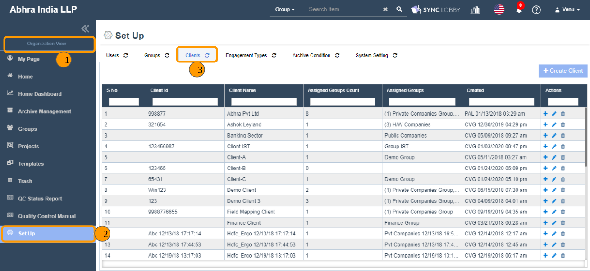

# \(Venu/Pending\) Set Up &gt; Clients

## Summary

1. The Clients screen can be accessed by both Super Admin and Group Admin users only.
2. The actions like create, edit, delete, assign groups to client can be performed by both users.
3. These clients can be used while creating a project and updating the project Information.

### Major components of Clients screen

1. Create Client
2. Edit Client
3. Delete Client
4. Assign/ Unassign Groups to Client

## 1. Create Client

1. Click the 'Set Up' button from the left navigation menu of the Organization View.
2. Click the 'Clients' tab at the top of the 'Set Up' page.
3. Clicking the ‘Create Client’ button displays the ‘Create Client’ dialog.
4. Enter the name of the client and Client ID.
5. Click the 'Create' button to add the client to the screen.


Duplicate clients won't be allowed while adding a client.


## 2. Edit Client

1. Find the client that you wish to revise the name.
2. Clicking the ‘Edit’ icon displays the ‘Edit Client’ dialog.
3. Enter the revised name of the client and click the 'Update' button to update the client's name.


Duplicate clients won't be allowed while editing a client.


## 3. Delete Client

1. Find the client that you wish to delete.
2. Clicking the ‘Delete’ icon displays the delete confirmation alert.
3. Clicking the 'OK' button in the confirmation alert removes the client.
4. Deleted clients can be restored from the 'Trash' screen.


A client cannot be deleted when it is associated with at least one project.


## 4. Assign/ Unassign Groups to Client

### 4.1. Assign groups to Client

1. Locate the client that you wish to assign groups to it.
2. Click the ‘Add Groups to Client’ plus icon under the 'Actions' column.
3. The ‘Assign to Client’ dialog will be displayed.
4. The LHS side of the dialog shows not assigned groups to client and RHS side shows assigned groups to the client.
5. Select one or more groups on the LHS side.
6. Click the right arrow assigns the groups to the Clients.


With this assignment, not all users of the Organization would be displayed under the ‘Administration &gt; Users &gt; Assign User’ dialog, instead, admins can see only the assigned users to the respective Group in which the current project is located.


### 4.2. Unassign groups from Client

1. Locate the client that you wish to unassign groups from client.
2. Click the ‘Add Groups to Client’ plus icon under the 'Actions' column.
3. The ‘Assign to Client’ dialog will be displayed.
4. The LHS side of the dialog shows not assigned groups to client and RHS side shows assigned groups to the client.
5. Select one or more groups on the RHS side.
6. Click the left arrow to unassign the groups from the Client.

