# \(Venu/Done\) PBC List - Request audit supported documents from your client

PBC stands for ‘Provided By Customer/ Client’. PBC is a list of items that users request from their audit clients when they perform audits. This is typically done by compiling the list in Excel and emailing them to the client and then they send their request by email manually.

PBC List function automates this whole process and the client can upload their requested documents directly into the application and it can alert users. 

## 1. Who can add, edit, delete PBC records?

1. Internal Users of project access rights “Project & Archive Admin, Project Admin, Project User” can create, edit, delete PBC records.
2. External Users of project access right ‘PC Upload’ can create, edit, delete PBC records. After visiting the project, they directly view the PBC List screen only.
3. The 'Read Only' users of Internal and External Type can view the PBC screen, but cannot do any actions on it.


After visiting the project, they directly view the PBC List screen only. The 'Project View' left navigation will not be displayed to the 'PBC Upload' users.


## 2. How does the reminder feature work on the PBC List?

1. The 'Reminder \(days\)' is a numeric field and has the sub-columns “B, A, R”.
2. User can input the zero or bigger values in the "B, A, R" columns. \(Ex: 0, 1, 2, 3, 4...etc\).
3. **B** stands for ‘Before’, so the first email reminder notification would be sent ‘**\#B**’ days before the 'Due Date'.
4. **A** stands for ‘After’, so the next email reminder notification would be sent ‘**\#A**’ days after the 'Due Date'.
5. **R** stands for ‘Recur’, so the recursive email reminder notification would be sent for every ‘**\#R**’ days after the ‘\#A’.
6. The email reminder notifications will be recursively sent to the client users until the 'Status' column of the PBC record is changed to 'Completed'.

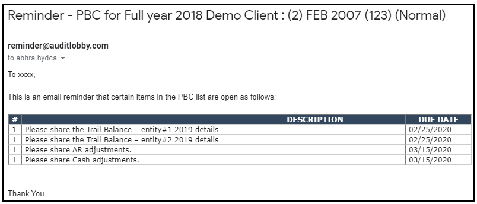

## 3. Add PBC records

> You can add the PBC records in two ways.
>
> 1. Add records manually.
> 2. Using the 'Import' facility.

### 3.1. Add records manually

1. Click the 'PBC List' in the left navigation menu of the 'Project View'.
2. Click the 'Add' button at the top of the screen.
3. An empty record will be displayed in the grid to input the details.
4. Fill the following fields:
   * **Area:** Enter the subject line here.
   * **Description:** Enter the detailed information of the PBC record here.
   * **Requested Date:** Select the future or current date here as required.
   * **Due Date:** It should be greater than or equal to the ‘Requested Date’.
   * **Reminder days \(B, A, R\):** Enter the reminder days \(numbers\) as required. \(B=Before, A=After, R=Recur\).
   * **Requested By:** Select the user.
   * **Requested To:** Select the 'External PBC upload' user whom you wish to request the documents to be shared.
5. Click the 'Save changes' link at the right-bottom of the screen, to save the records.
6. This way, you can add as many records as you required.


You cannot select the past date in the 'Requested Date' and 'Due Date' fields.



'Due Date' should be greater than or equal to the ‘Requested Date’.


### 3.2. Using the 'Import' facility

> Using this, you can add the bundle of PBC records at once.

1. Click the ‘Template’ button at the top of the screen.
2. A template excel file will be downloaded for the import into your computer.
3. Fill the excel file with as many records as you required \(Area, Description, Due Date, Before, After, Recur\).
4. Save the file.
5. Click the 'Browse' button to view the file explorer window for the file selection.
6. Select the saved file in \#5.
7. Click the 'Open' button or hit the ENTER key.
8. Click the 'Import Data' button.
9. Wait till all excel file data get inserted into the application.
10. On the screen, you can view the success message and the records that are imported.

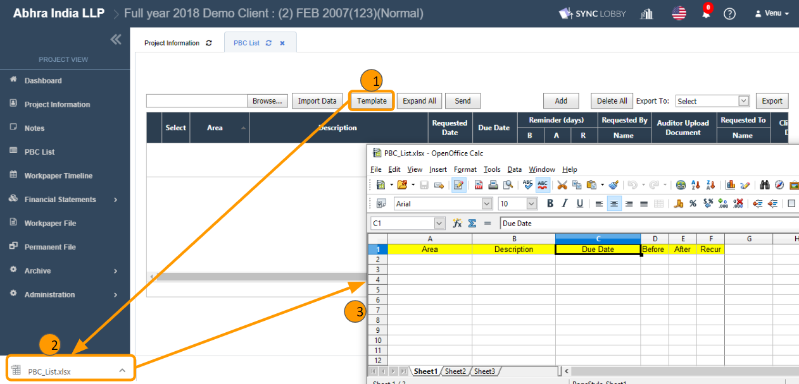

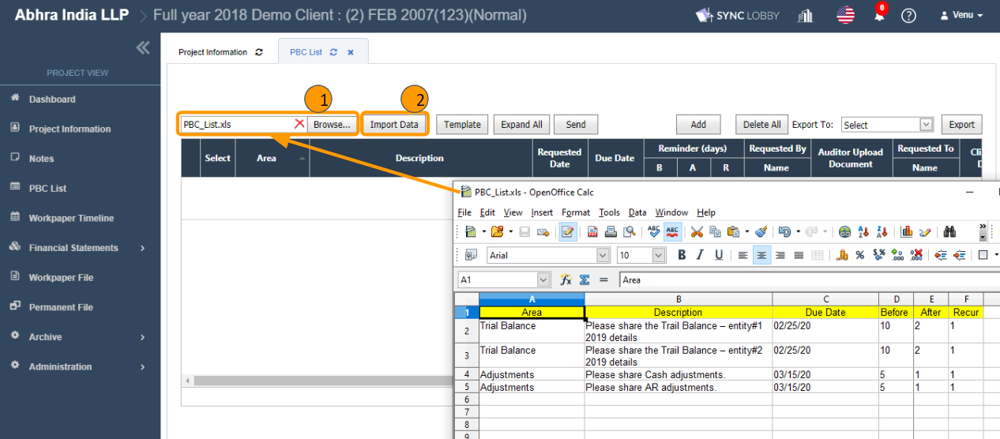

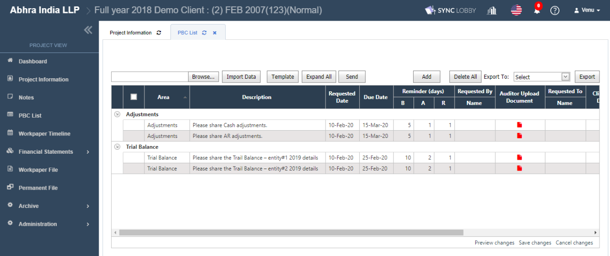

## 4. Auditor upload documents section

> This is the place where the general auditors \(internal users\) can upload the reference documents for the client users to share the supporting documents in the suggested format.

1. It’s an optional field.
2. Find the PBC record that you wish to add documents for the client users reference.
3. Click the red colored file icon under the 'Auditor Upload Documents' column.
4. You will be navigated to the detail section.
5. You can add files in two ways.
   1. Using the 'Browse' button.
   2. Drag & drop of the files from your computer.
6. You can also perform the operations like update the content of the file, edit the file name and delete the file.


In the auditor uploaded documents screen, PBC Upload users \(Clients\) can view & download, but cannot perform operations like add, edit, delete documents.


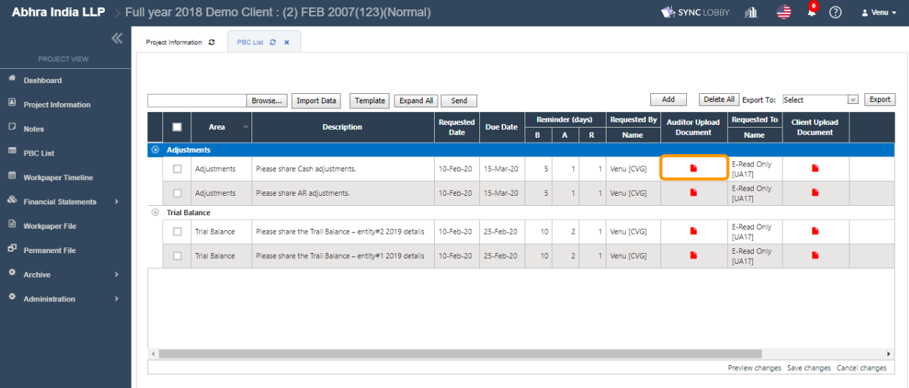

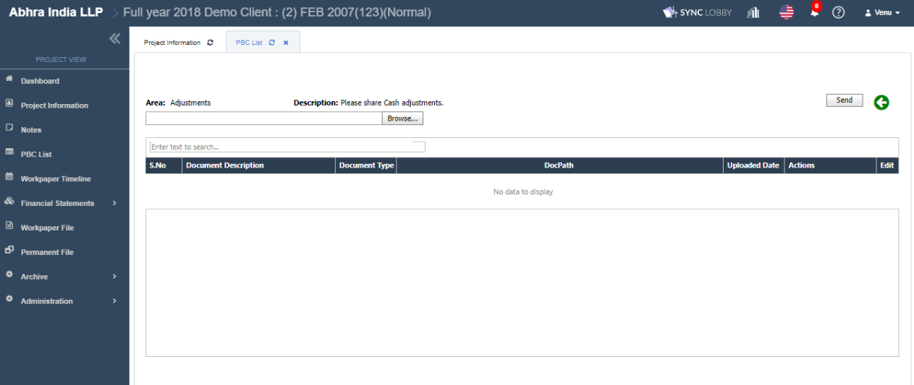

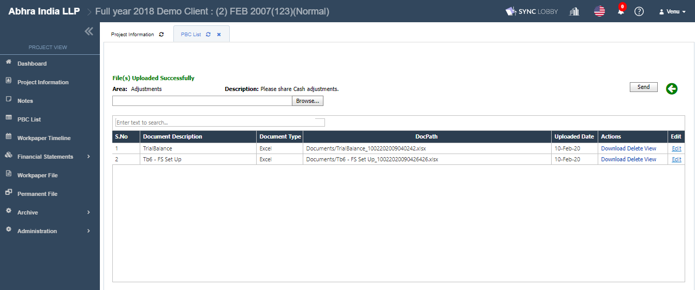

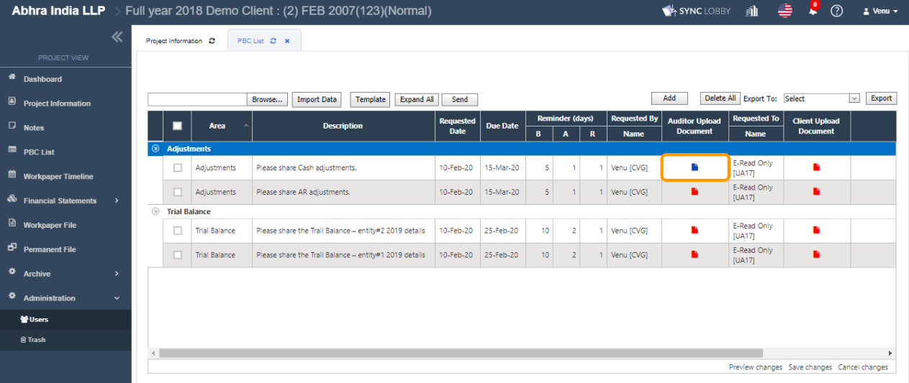

## 5. Client Upload Documents section

> This is the place where the clients \(External PBC users\) can upload their requested documents.


Only PBC users \(External Users\) can add \(upload\) documents on the screen and Internal Users cannot.


1. Client users who are PBC Upload users can log in to the application.
2. Go to 'My Page &gt; Assigned Projects' screen in the left navigation menu of the Organization View.
3. Find and visit the project to which you \(Client user\) wish to upload the supporting documents.
4. Only the 'PBC List' screen visible you.
5. Find the PBC record that you wish to add documents.
6. Click the red colored file icon under the 'Client Upload Documents' column.
7. You will be navigated to the detail section.
8. You can add files in two ways.
   1. Using the 'Browse' button.
   2. Drag & drop of the files from your computer.
9. You can also perform the operations like update the content of the file, edit the file name and delete the file.

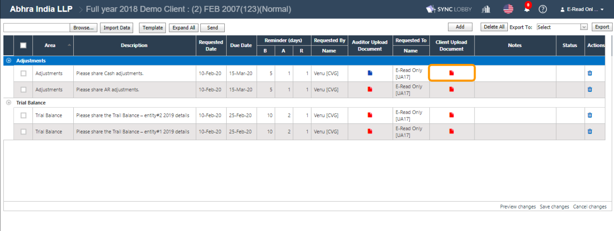

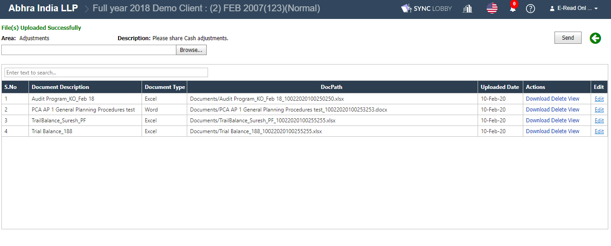

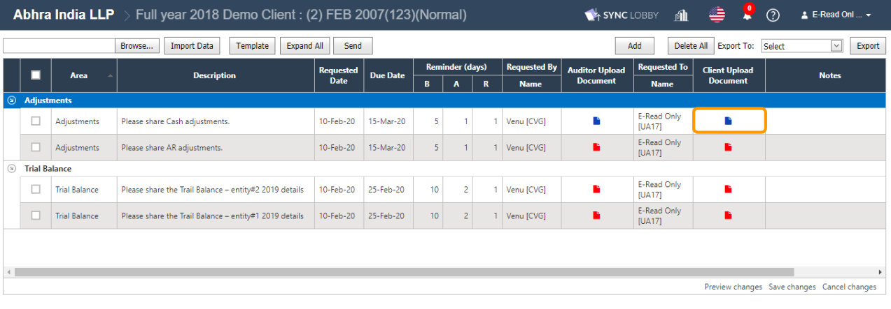

### 5.1. Send file\(s\) upload status to auditors

After uploading of requested files, PBC users can send the instant email reminder notification about the supporting documents upload status to the 'Request To' users \(auditors\) by clicking the 'Send' button.

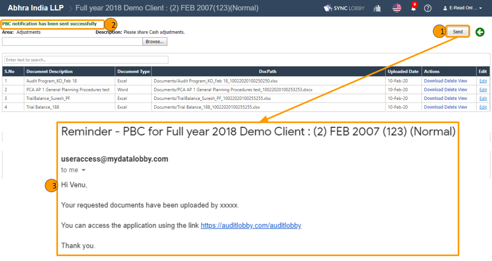

## 6. Edit PBC records

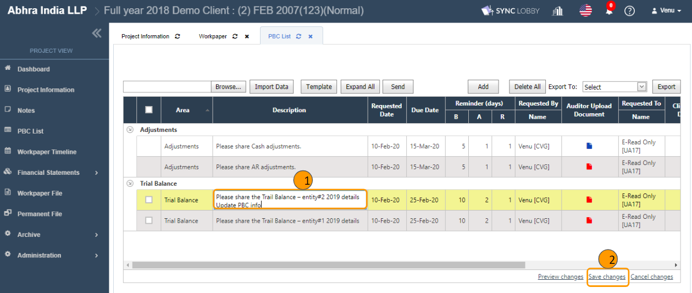

1. Find PBC record\(s\) you wish to update.
2. Click the respective cell, it will be turned to edit mode.
3. Revise the information as required.
4. Click the 'Save changes' link at the bottom-right of the screen.
5. This way, you can revise the information for the required ones and can save all at once.


You cannot update PBC records information which are 'Completed' state.



Both general auditors and client users can update the information.


## 7. Change the status of PBC record to 'Completed'

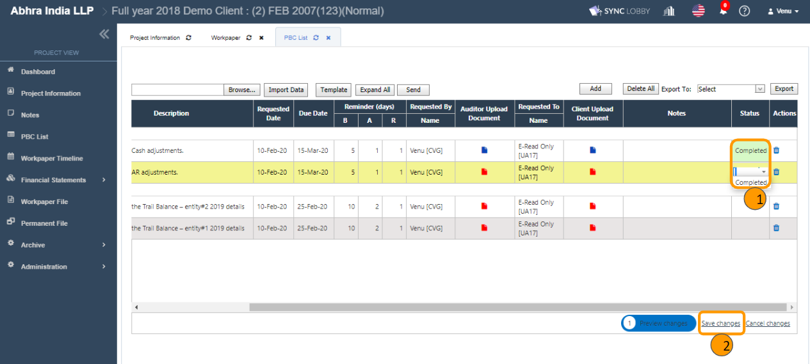

> If you believe that you have received all the requested documents from clients for the respective PBC record, then you can change the status to 'Completed'.

1. Find the PBC record\(s\) that you wish to change the status to 'Completed'.
2. Click the 'Status' cell.
3. Select the 'Completed' value.
4. Click the 'Save changes' link at the bottom-right of the screen.


Both general auditors and clients can change the status to 'Completed'.



The 'Completed' PBC records would be excluded in the email reminder notification.



Once the status is changed to 'Completed' and saved, you cannot roll back and update any of its information. Hence, please be cautious while changing the status.


## 8. Delete PBC records

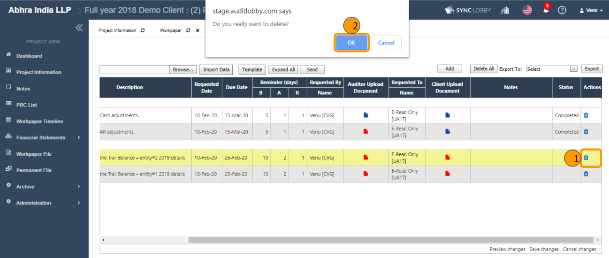

1. Find the PBC record that you wish to delete.
2. Click the 'Delete' icon under the 'Actions; column.
3. Click the 'OK' button in the confirmation alert.
4. You can observe that the corresponding record will be disappeared from the screen.


Admin users can restore the deleted PBC records from the 'Trash' screen of the 'Project View'.


