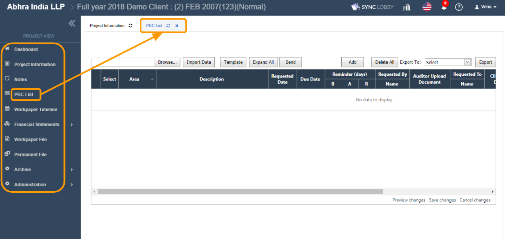
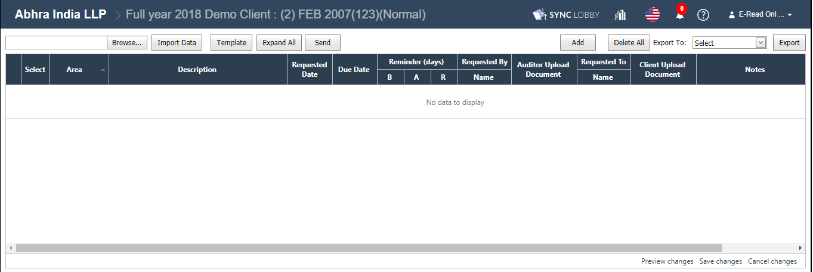
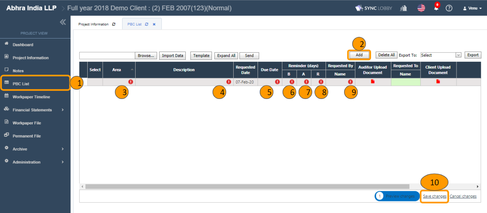

# \(Venu/Pending\) PBC List - Request audit supported documents from your client

PBC stands for ‘Provided By Customer/ Client’. PBC is a list of items that users request from their audit clients when they perform audits. This is typically done by compiling the list in Excel and emailing them to the client and then they send their request by email manually.

PBC List function automates this whole process and the client can upload their requested documents directly into the application and it can alert users. 

## 1. Who can add, edit, delete PBC records?

1. Internal Users of project access rights “Project & Archive Admin, Project Admin, Project User” can create, edit, delete PBC records.
2. External Users of project access right ‘PC Upload’ can create, edit, delete PBC records. After visiting the project, they directly view the PBC List screen only.
3. The 'Read Only' users of Internal and External Type can view the PBC screen, but cannot do any actions on it.


After visiting the project, they directly view the PBC List screen only. The 'Project View' left navigation will not be displayed to the 'PBC Upload' users.


## 2. How does the reminder feature work on the PBC List?

1. The 'Reminder \(days\)' is a numeric field and has the sub-columns “B, A, R”.
2. User can input the zero or bigger values in the "B, A, R" columns. \(Ex: 0, 1, 2, 3, 4...etc\).
3. **B** stands for ‘Before’, so the first email reminder notification would be sent ‘**\#B**’ days before the 'Due Date'.
4. **A** stands for ‘After’, so the next email reminder notification would be sent ‘**\#A**’ days after the 'Due Date'.
5. **R** stands for ‘Recur’, so the recursive email reminder notification would be sent for every ‘**\#R**’ days after the ‘\#A’.
6. The email reminder notifications will be recursively sent to the client users until the status is changed to 'Completed' for the pbc records.

## 3. Add PBC records

> You can add the PBC records in two ways.
>
> 1. Add records manually.
> 2. Using the 'Import' facility.

### 1.1. Add records manually

1. Click the 'PBC List' in the left navigation menu of the 'Project View'.
2. Click the 'Add' button at the top of the screen.
3. An empty record will be displayed in the grid to input the details.
4. Fill the following fields:
   * **Area:** Enter the subject line here.
   * **Description:** Enter the detailed information of the PBC record here.
   * **Requested Date:** Select the future or current date here as required.
   * **Due Date:** It should be greater than or equal to the ‘Requested Date’.
   * **Reminder days \(B, A, R\):** Enter the reminder days \(numbers\) as required. \(B=Before, A=After, R=Recur\).
   * **Requested By:** Select the user.
   * **Requested To:** Select the 'External PBC upload' user whom you wish to request the documents to be shared.
5. Click the 'Save changes' link at the right-bottom of the screen, to save the records.


You cannot select the past date in the 'Requested Date' and 'Due Date' fields.



'Due Date' should be greater than or equal to the ‘Requested Date’.


## 

