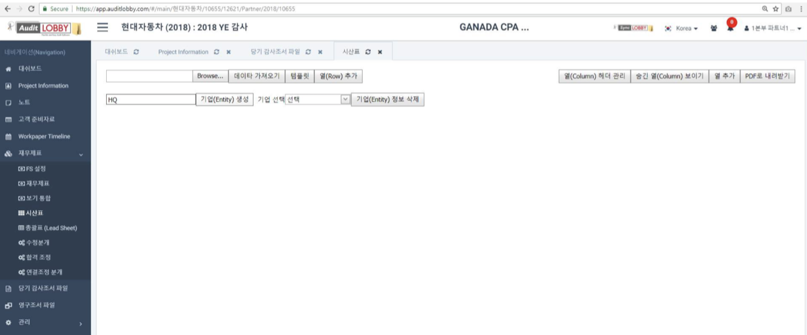
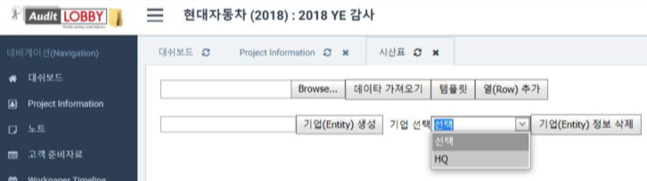
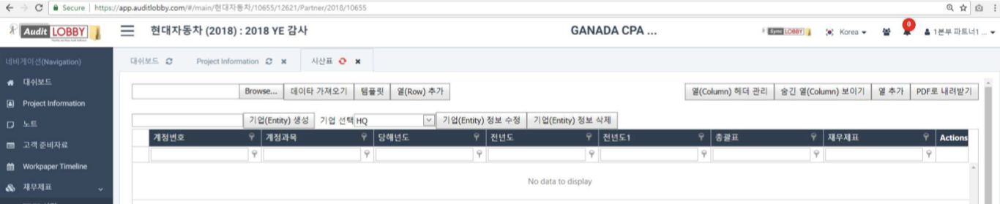
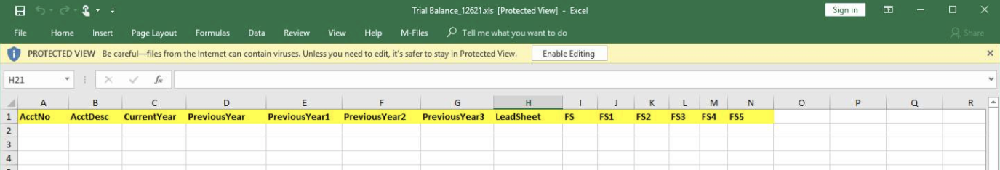
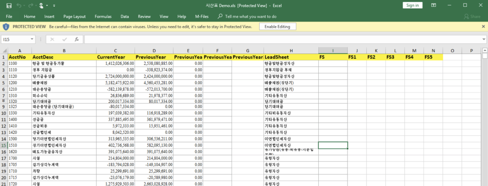
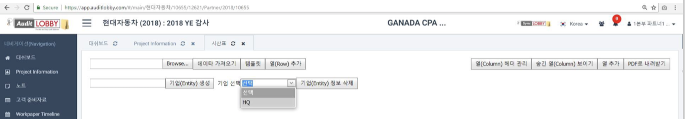
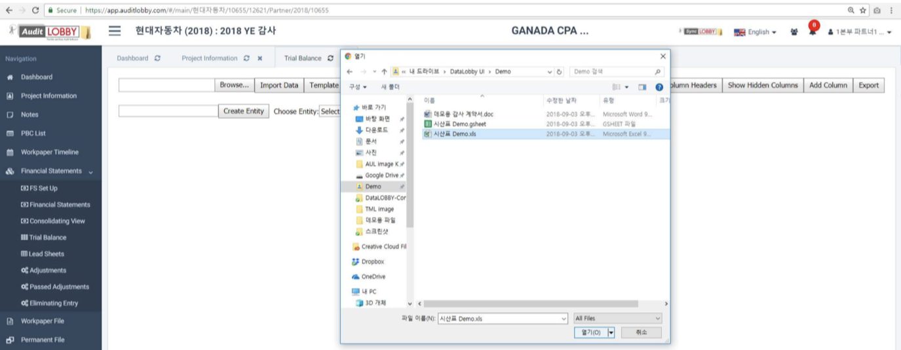
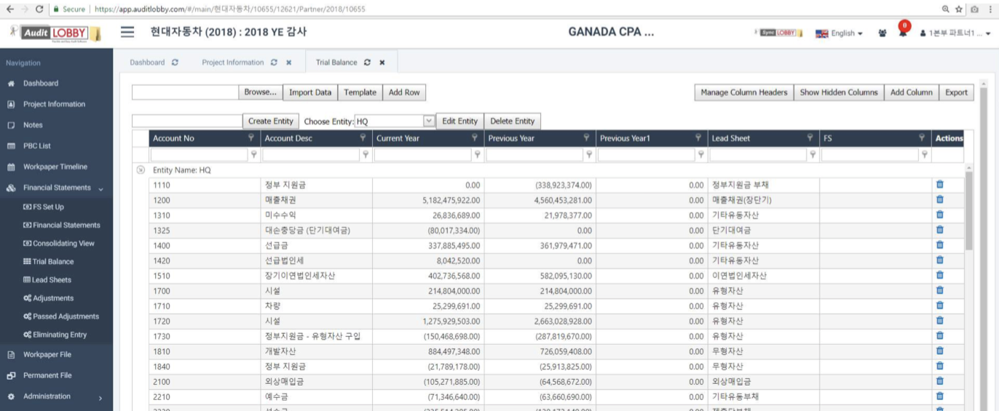

# 1-1. Trial calculation

## 1. Company Registration

1. Create a parent company**.** \(Head Quarter\)
   1. Enter the name of the parent company and press the 'Create Entity' button.
2. Create a subsidiary. \(Entity\)
   1. Enter the name of the subsidiary and press the 'Create Entity' button.

## 2. Trial template download

Download Trial Balance Template

1. Select the parent company or subsidiary you want to work on by clicking on 'Select company' drop down. 
2. Click the 'Template' button at the top of the screen to download the basic trial balance template. 

## 3. Trial calculation

Fill out the trial balance using the downloaded template.

> 3-3-1\) Complete the lead sheet portion of the trial balance form.  
> 3-3-2\)Complete the Financial Statements portion of the Trial Balance Form.

## 4. Trial and Balance Sheet Linking

> Link the trial and balance tables.

4-1. Select the parent company or subsidiary to register the trial balance.

4-2. Click the Browse button to select the trial file you worked on on your personal computer.

4-3. Click on the Import data button to import the trial file selected in 4-2.

4-4. Make sure your work on your personal computer is what you see on the screen. The FS \(Financial Statement\) item in the Trial Balance is linked to the advisable FS \(Financial Statement\) screen.

