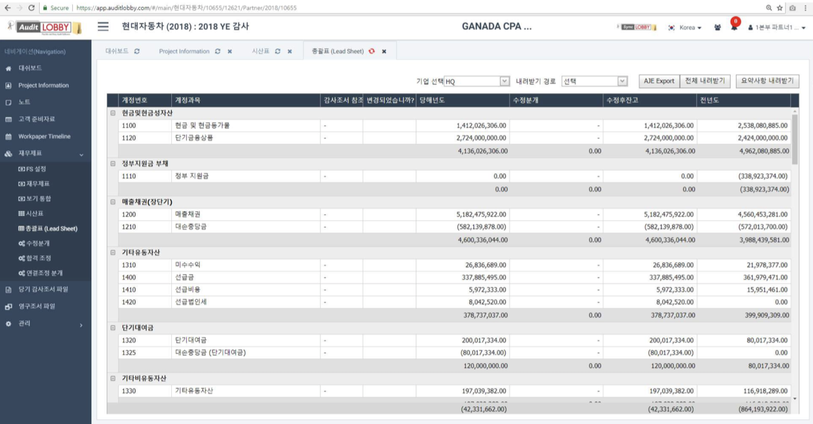

# 1-2. General Set

1. From the Project menu, select Financial Statements.
2. Select 'Lead Sheet', a sub item of the 'Financial Statements' menu.
3. Select parent company or subsidiary from 'Select company'.
4. Check the overall table of the selected parent company or subsidiary.

In the following cases, the edits will be automatically reflected in the aggregate table.

> 1. Trial Balance is modified
> 2. When an adjustment journal entry is made

