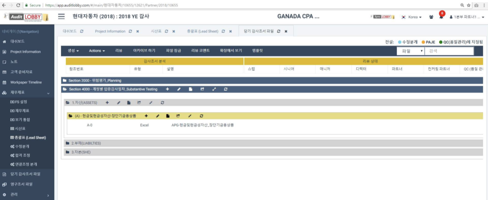
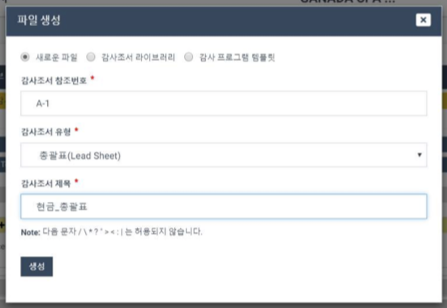
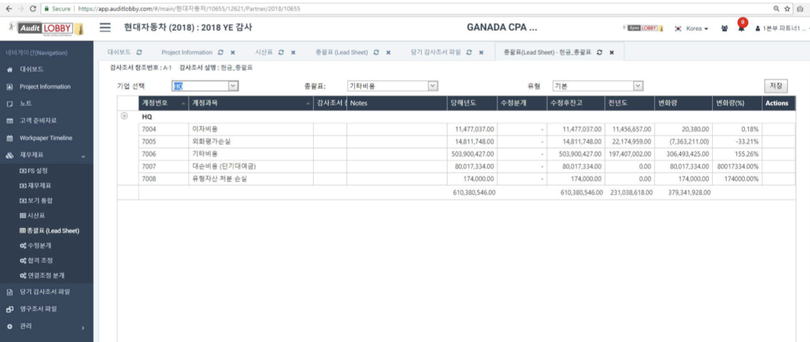
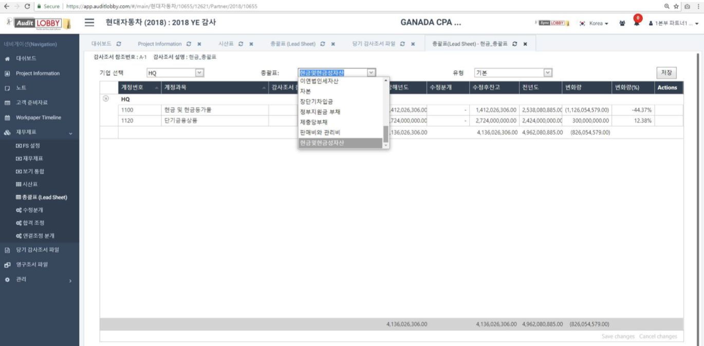
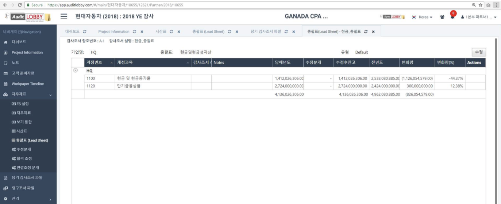
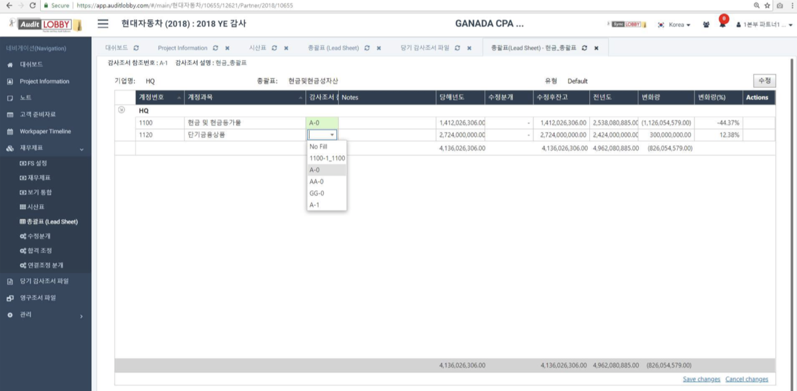
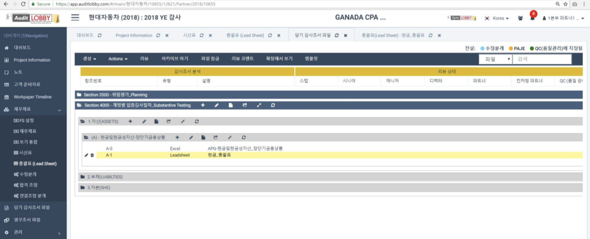
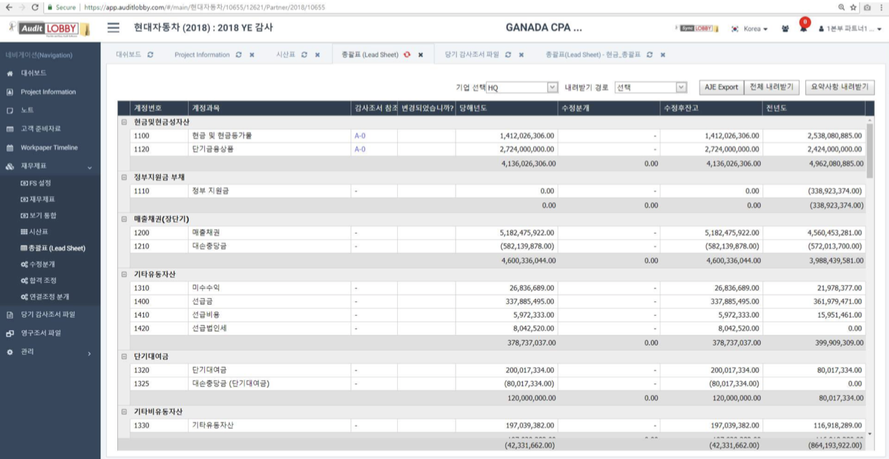
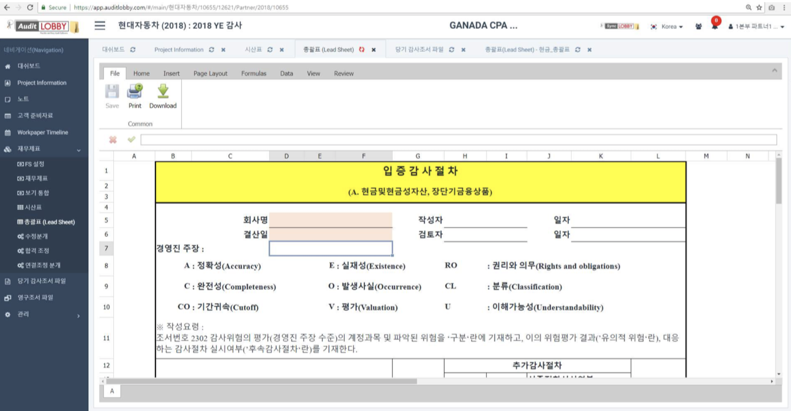

# 1-3. Linking Leadsheets and records

From the Project menu, select Worksheet.

## 1. Create a Leadsheet record

Create a Lead Sheet Workpaper inside the Worksheet.

1. Press the 'Create' button in the contents header of the workspace.
2. Select 'New file'
3. Enter the audit note reference number.
4. Select the audit report type as "Blank".
5. Enter the title of the audit report.

Press the 'Create' button at the bottom of the dialog to open the global screen.

## 2. Leadsheet screen

### 2-1. Select the parent company or subsidiary in the top "Corporate Selection" section of the Balance Sheet screen.

### 2-2. In the Lead sheet section, select Account.

### 2-3. Check the overall table for this account.

### 2-4. Link audit documents according to your account. \(Use the record number.\)

## 3. Check the association link

In the lead sheet screen, link the audit record to the account in the record, and then return to the Audit Report File screen.

'LeadSheet' will appear in the audit report that you linked to your account in the Leadsheet sheet screen \(Summary table screen\)

Go to the overall table and check the contents of the linked audit documentation.

> You can select the parent company or subsidiary from the General menu and click on link to see the connected audit documentation reference.

