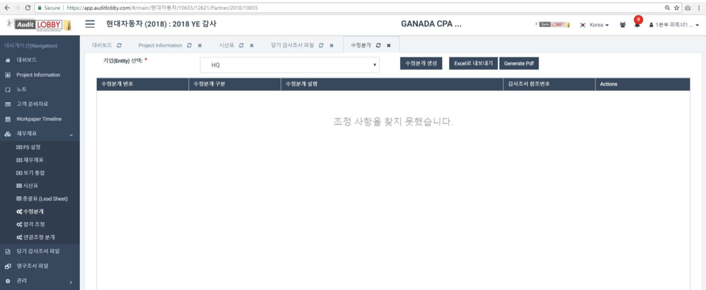
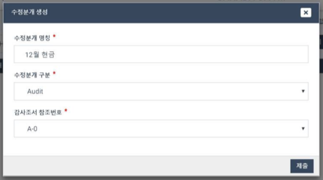
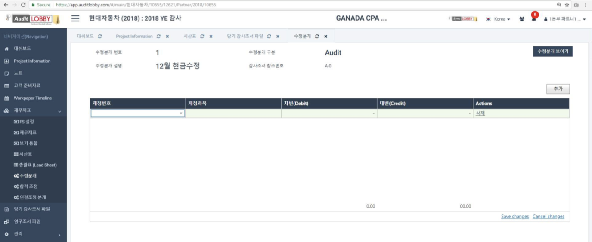
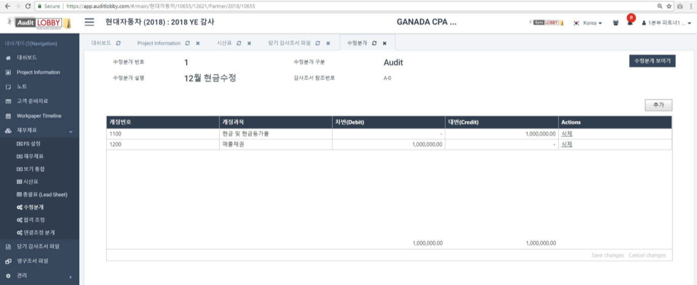
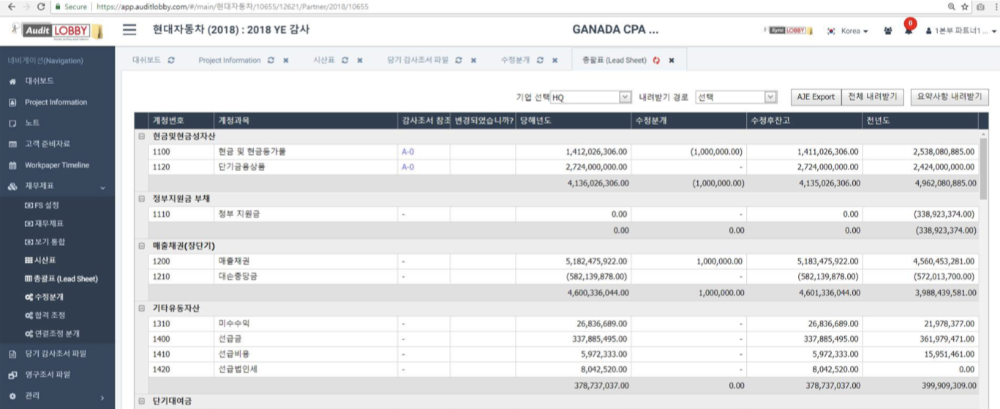

# 1-4. Revision/Adjustment Journal

## 1. Select an entity in the Adjustment screen

1. From the Project menu, select Financial Statements.
2. Select 'Adjustment' which a child of 'Financial Statements'.
3. Select an entity.

## 2. Create Adjustment

1. Click the Create Adjustment button. \(The window above appears.\)
2. Enter a title for the revision journal.
3. Select the classification of the revision journal.
4. Enter the audit note/workpaper reference number.
5. Pressing the 'Submit' button will create an adjustment journal as shown below.

## 3. Enter the correction journal entry


After entering your changes, be sure to press Save Changes at the bottom of the screen.


## 4. Confirm revision of journal entry

1. Go to the Executive Summary/Leadsheet screen and select the parent company or subsidiary.
2. You can see that the company reflects the modifications in the journal entry.

