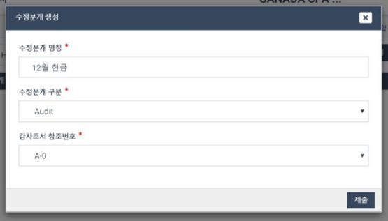

# 1-5. Passed Adjustments \(Unreflected Correction Journal\)

1. Select Financial Statements from the left menu of the Project Home screen.
2. Select the "Passed Adjustment" sub-item of "Financial statements."

How to create Passed Adjustment is same as how to create an Adjustment in 1-4 section

However, the contents of passed adjustments are not reflected in the summary screen.

