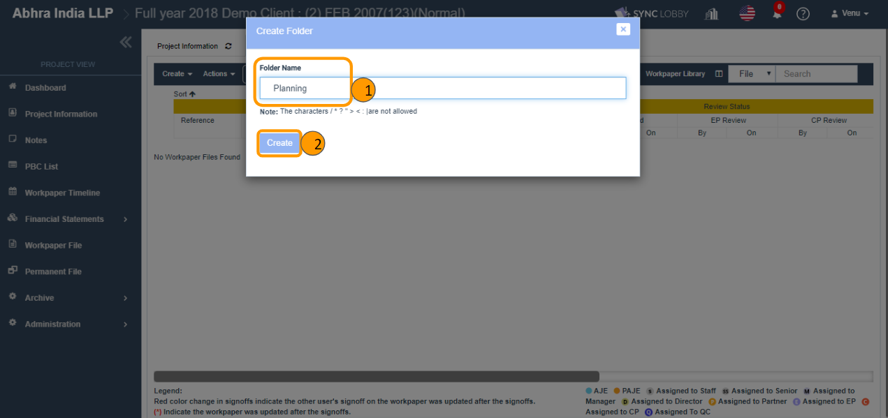

# \(Venu/Pending\)2-1-1. Documenting Workpaper Files

You can create and edit workpaper in online on Audit LOBBY.

However, if an auditor is working on a file, you are not allowed to edit the same file to prevent conflicts. If you wish to edit, you can request the auditor \(who is currently editing\) to close the file.

## 1. Create a Workpaper Folder

#### 1-1. How to create a workpaper folder 

1. Visit the project that you wish to add working documents.
2. Click the 'Workpaper File' option on the left navigation menu of the Project View.
3. Click the 'Create' button on the top-left of the 'Workpaper' screen.
4. Clicking the 'New Folder' option displays the 'Create Folder' dialog.
5. Enter a folder name and click the 'Create' button.
6. On the screen, you can view the success message and the folder that got created.
7. Like this, you can add folders as many as you required.

#### 1-2. How to create a subfolder under a folder

1. Click the folder that you wish to add a subfolder.
2. Clicking the '+' icon next to the folder name displays the 'Create Folder' dialog.
3. Enter the folder name and click the 'Create' button.
4. On the screen, you can view the success message and the folder that got created.
5. Like this, you can add subfolders as many as you required.

## 2. Create & Edit Online Workpaper    

1. Select the folder that you wish to add a workpaper.
2. Clicking the document icon \(Create File\) next to the folder name displays the 'Create File' dialog.
3. Click the **'New File'** option in the dialog.
4. Enter the Workpaper Reference, Workpaper Type, and the Workpaper Title
5. Click the 'Create' button.
6. On the screen, you can view the success message and the file that got created.
7. Double click the file to open it on the web and edit.
8. Click the **'Save'** button in the top-left corner after editing.

## 3. How to view the files that are opened in online or sync lobby

1. Click the 'Actions' button at the top of the 'Workpaper' screen.
2. Click the 'Opened Workpape List' option.
3. The 'Opened Workpaper List' dialog will be displayed.
4. Clicking the 'Opened By Me' tab displays the files that are opened by you.
5. Clicking the 'Opened By Others' tab displays the files that are opened by others.

