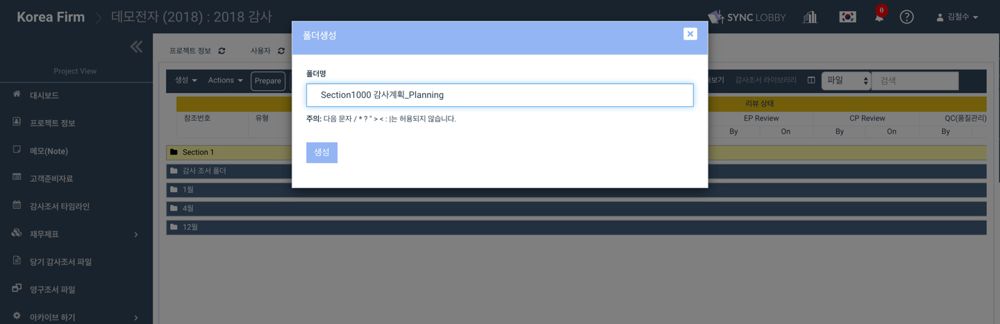

# \(ENG\)2-1-1. 온라인으로 조서 작성하기

어딧로비를 통해 온라인에서 실시간으로 조서를 생성하고 수정할 수 있습니다.

단, 다른 감사인이 조서를 수정하고 있는 경우 충돌을 막기 위하여 조서 수정이 제한됩니다. 필요한 경우 현재 작업중인 감사인에게 작업 우선권을 요청할 수 있습니다.

## 1. 감사조서 폴더 생성

### 1-1. 감사조서 폴더 만들기

1. 프로젝트 메뉴에서 '당기 감사조서 파일'을 선택합니다. 
2. '당기 감사조서 파일' 탭 상단의 '생성'을 누르고 하위 항목에서  '새폴더 생성하기'를 선택합니다.
3. 생성할 폴더의 폴더 명을 입력한 후 '생성' 버튼을 클릭합니다.

### 1-2. 폴더 안에 하위 폴더 만들기

1. 1-1에서 생성한 폴더를 클릭하여 선택합니다.
2. 폴더 이름 우측에 나타나는 + 모양 아이콘을 클릭합니다.
3. 생성할 하위 폴더의 폴더명을 입력한 후 '생성' 버튼을 클릭합니다.
4. 프로젝트에 필요한 폴더들을 구축할 때까지 반복합니다.

## 2. 온라인 조서 만들기 / 수정하기 

1. 감사조서 파일을 생성할 폴더를 선택합니다.
2. 폴더명 우측의 문서 모양 아이콘을 클릭합니다.
3. 팝업창 상단의 '새로운 파일', '감사조서 라이브러리', '감사 프로젝트 템플릿' 중 '**새로운 파일**'을 선택합니다. 
4. 감사조서 참고번호, 감사조서 유형, 감사조서 제목을 입력합니다.
5. 각 항목이 생성할 감사조서와 일치하는 지 확인하고 '생성' 버튼을 클릭합니다.
6. 생성할\(또는 편집할\) 감사조서 파일을 선택합니다.
7. 파일을 더블 클릭하면 웹에서 파일이 열리며 편집할 수 있습니다.  
8. 편집 완료 후 왼쪽 상단의 **저장\(Save\)버튼을 누릅니다**.

## 3. 온라인에서 작업 중인 파일 확인

1. 화면 상단의 종 모양 아이콘을 눌러 '알림' 화면을 불러옵니다. 
2. '알림' 화면에서 'Workpaper Files'를 선택합니다.
3. '알림' 화면에서 '열려있는 파일'을 선택합니다. 
4. 현재 작업 중인 파일이 있거나, 다른 공동작업자가 작업중인 파일이 있다면 목록이 나타납니다. 

