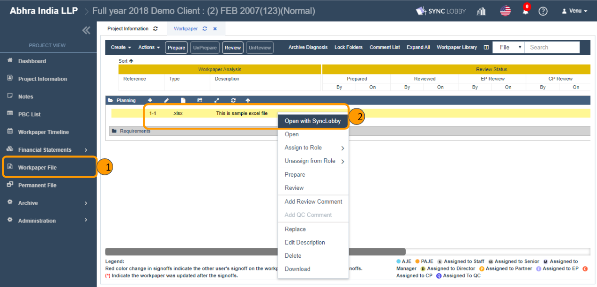
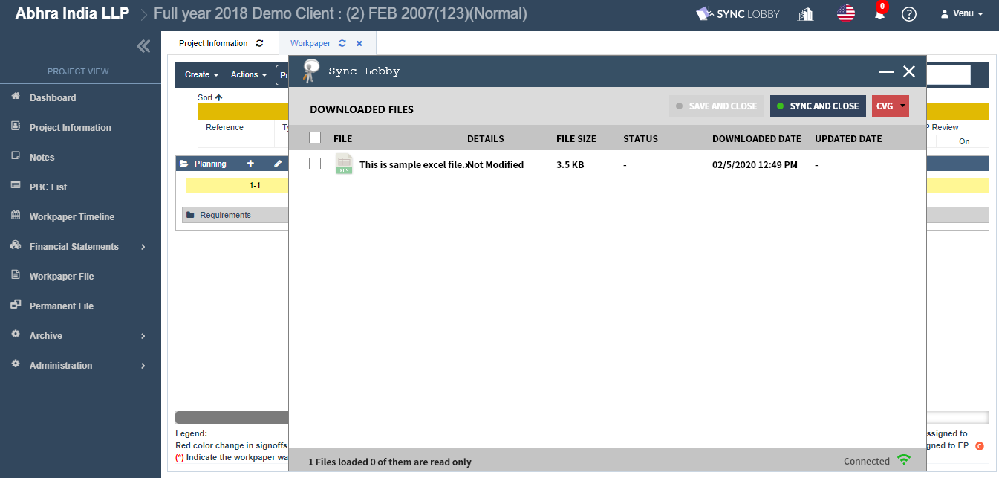
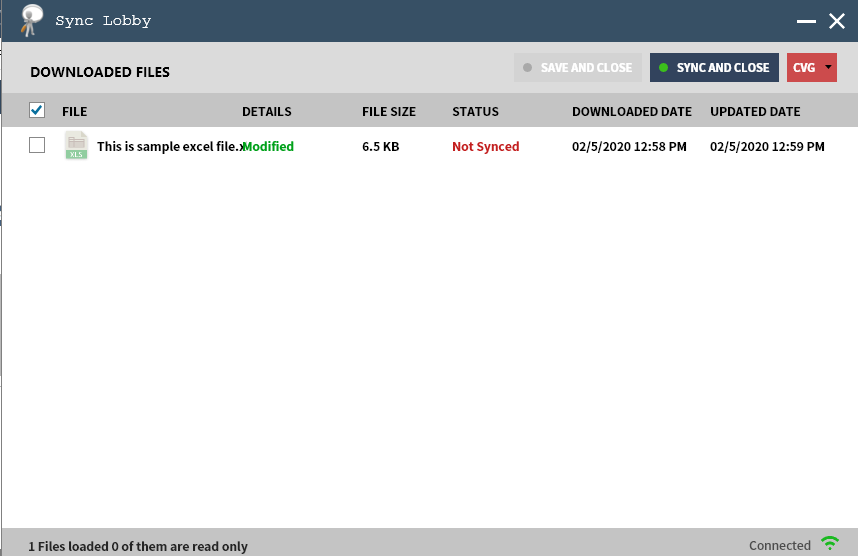

# \(Venu/Pending\)2-1-2. Open files using Sync LOBBY


Before you open the workpaper using Sync LOBBY, make sure the following two softwares got installed on your machine.

* Sync LOBBY desktop application \(You can download from Audit LOBBY application\).
* MS Office.


## 1. Install Sync LOBBY

## 2. Open Workpaper Using Sync LOBBY

If you open a workpaper on Audit LOBBY using Sync LOBBY, it internally opens the file in MS Office on your PC. You can do the changes to the file as required and sync the latest file back to the cloud.

1. Click the 'Workpaper File' button on the left navigation menu of the Project View.
2. Right-click the workpaper that you wish to work. Click the 'Open with Sync Lobby' option.
3. The Sync Lobby desktop application gets activated and the Login screen will be displayed.
4. Log in with your Audit Lobby application credentials.
5. The points \#4 and 5 will be bypassed if you already have logged-in to sync lobby.
6. The file will be added to the Sync Lobby and automatically be opened using MS Office.
7. Do the changes in the file as required.
8. Save and Close the file once you are done with your changes.
9. Click the 'SYNC AND CLOSE' button on the Sync Lobby application.
10. Wait till you see the success message.
11. Once the file is synced successfully, it will be disappeared from the Sync Lobby.
12. Open the file in the Online editor to view your latest changes.

