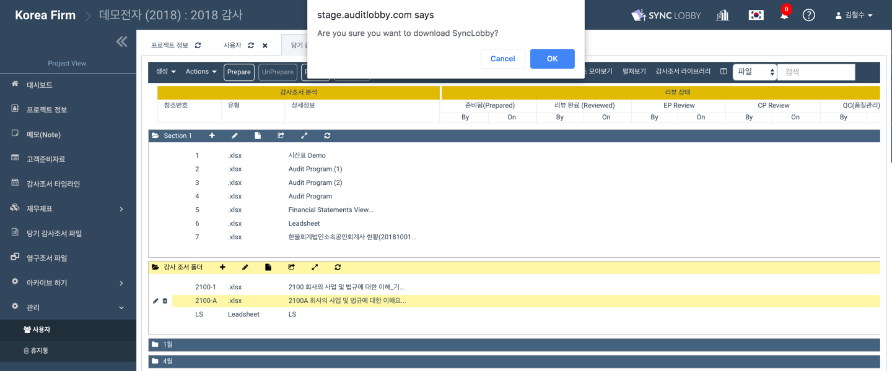

# 2-1-2. 싱크로비로 조서 작성하기


싱크로비로 조서를 열기 전 먼저 싱크로비를 설치하여 주십시오.


## 1. 싱크로비 설치하기 

## 2. 싱크로비로 감사조서 열기  

싱크로비를 통해 어딧로비의 감사조서를 열면, 개인 컴퓨터의 MS Office 를 이용하여 조서를 작성할 수 있습니다. 작업이 완료된 감사조서는 어딧로비의 클라우드로 동기화할 수 있고, 다른 작업자가 곧바로 이어받아 작업할 수 있습니다.  

1. 프로젝트 홈\(Project Home\) 화면의 왼쪽 메뉴에서 '당기 감사조서 파일'을 선택합니다.
2. 작업하고자 하는 감사조서를 우클릭하여 'Open with Sync LOBBY' 를 선택합니다. 

