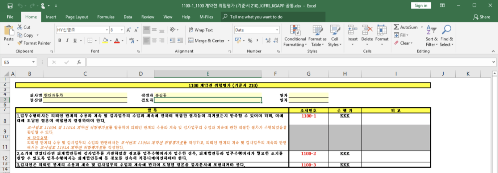

# \(ENG\)2-1-2. Documenting Workpapers Using Sync LOBBY


Make sure to install Sync LOBBY first before opening workpaper using Sync LOBBY.


## 1. Install Sync LOBBY

## 2. Open Workpaper Using Sync LOBBY

If you open workpaper on Audit LOBBY using Sync LOBBY, you can work on workpaper using MS Office on your PC. The finished workpaper will be synchronized to the cloud of Audit LOBBY and others can work on it right away.

1. Click the 'Workpaper File' button from the left menu column of the Project View
2. Right click the workpaper you want to work on and click 'Open with Sync LOBBY'

