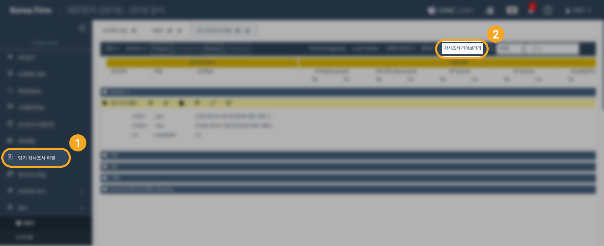
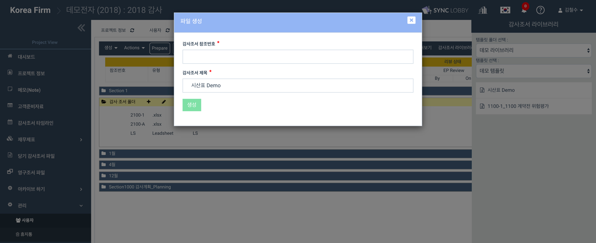

# \(Venu/Pending\)2-1-3. Documenting Workpapers Using Workpaper Library \(Template\)

The ‘Project Templates’ can be utilized while creating a new project, whereas the 'Workpaper Library' is used to add files on the ‘Workpaper’ screen after visiting the project.

## 1. Use Workpaper Library to document Workpapers

1. Click the 'Workpaper File' option on the left navigation menu of the Project View.
2. Expand the folder that you wish to add files.
3. Click 'Workpaper Library' at the top menu.
4. The 'Workpaper Library' menu will be opened at the right of the screen.
5. Select the Template folder in the 'Choose Template Folder' drop-down.
6. The 'Choose Template' drop-down displays the sub-template folders according to your template folder section.
7. Selecting the sub-template displays the list of files belongs to it.
8. Click & Hold the desired file.
9. Drag the file onto the folder and drop it in the drop zone.
10. The 'Create File' dialog will be displayed.
11. Enter the 'Workpaper Reference' and revise the 'Workpaper Title' if required.
12. Click the 'Create' button.
13. You can view the success message and the file that is created on the screen.

