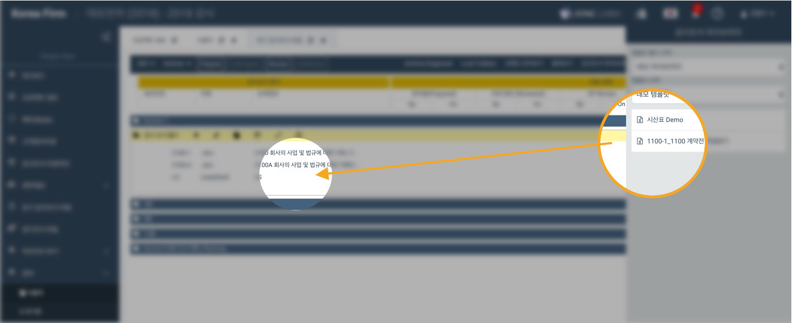

# \(ENG\)2-1-3. Documenting Workpapers Using WorkPaper\(Template\) Library

When you are creating a new project, you can use templates to form the whole structure of the project and also use individual workpaper files from the template library.

## 1. Use Workpaper\(Template\) Library to document Workpapers

1. Click the 'Workpaper File' button from the left menu column of the Project View
2. Click 'Workpaper Library' on the top menu bar
3. Click the right folder on the workpaper library pop-up tab on the right
4. Select the template to use on 'Template Selection'
5. The template file would appear at the bottom. Drag and drop the file to the right workpaper folder on left
6. Enter the workpaper reference
7. Click the 'Create' button

