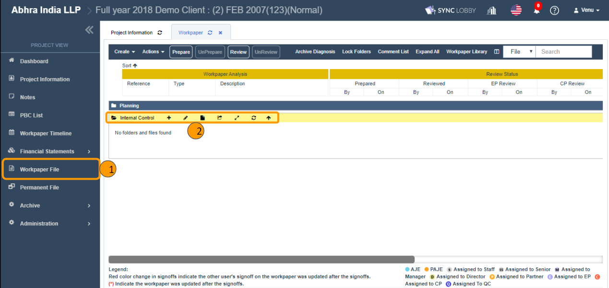
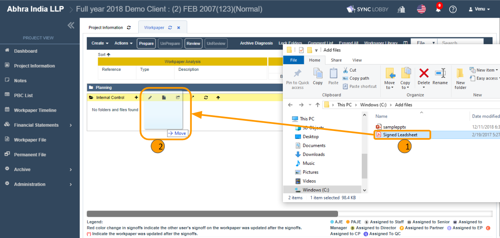
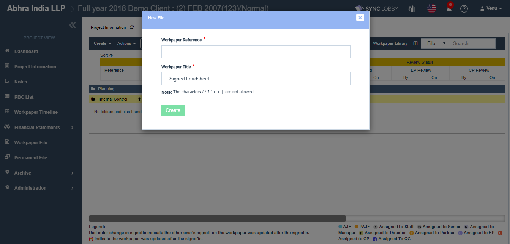
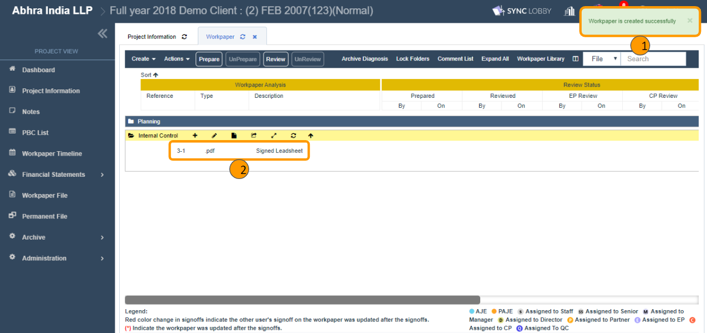

# \(Venu/Done\)2-2-3. Add file using 'Drag & Drop' facility

## 1. Go to Project View &gt; Workpaper File

1. Click the 'Workpaper File' on the left navigation menu of the Project View.
2. Click the folder that you wish to add a file.
3. In your computer, open the folder that contains files you wish to upload \(Windows - File Explorer / Mac - finder\).

## 2. Open the folder and drag & drop the file

1. From your computer, open the folder that contains the file you wish to add.
2. Drag the file and drop onto the drop zone of Audit Lobby.

## 3. File the file details and click the 'Create' button

1. Fill out the Workpaper Reference \(reference number\).
2. Revise the Workpaper Title if required.
3. Click the 'Create' button.
4. On the screen, you can view the success message and the file that is created.

