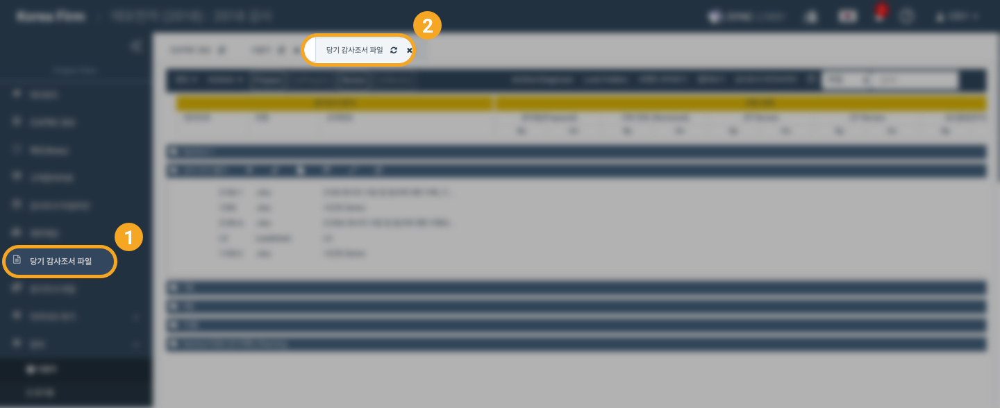
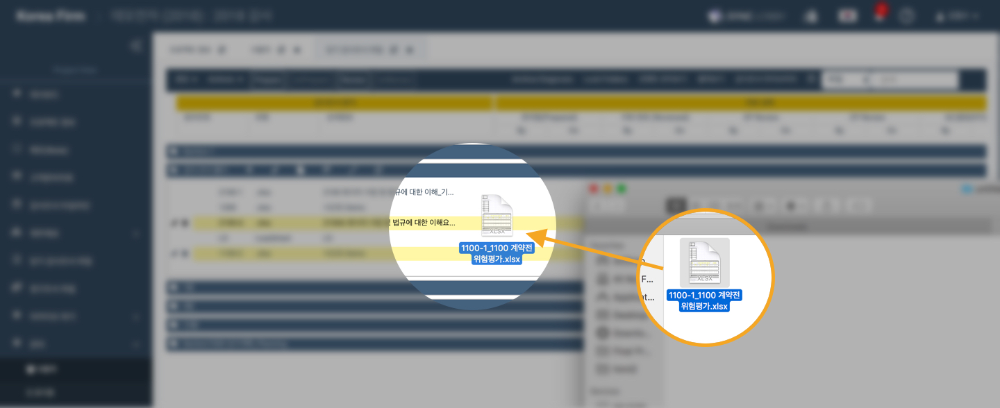
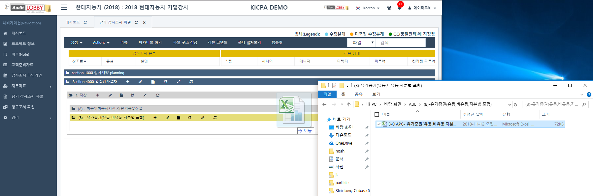
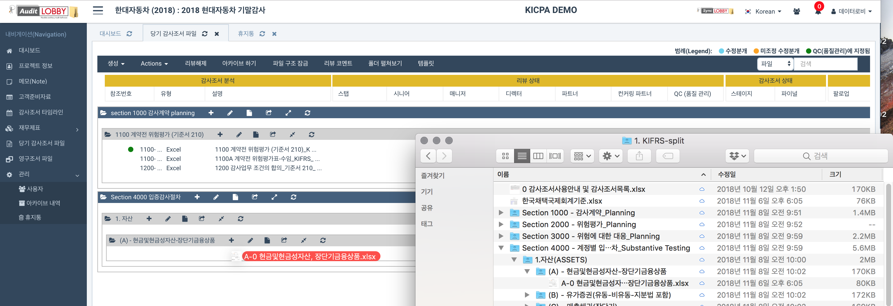

# \(ENG\)2-2-2. Uploading Workpaper File Using Drag and Drop

1. Prepare the audit statement file to be uploaded
2. In the project list \(Project View\), select 'Workpaper File' from the left menu list
3. In the 'Workpaper File' screen, select the folder to upload the file and open it
4. In your computer, open the folder that contains the files you want to upload \(Windows - File Explorer / Mac - finder\)

5. Drag file to upload. \(Drag and Drop\)‌

6. Fill out the audit reference number \(reference number\)

7. Click 'Create' button to complete uploading workpaper file

